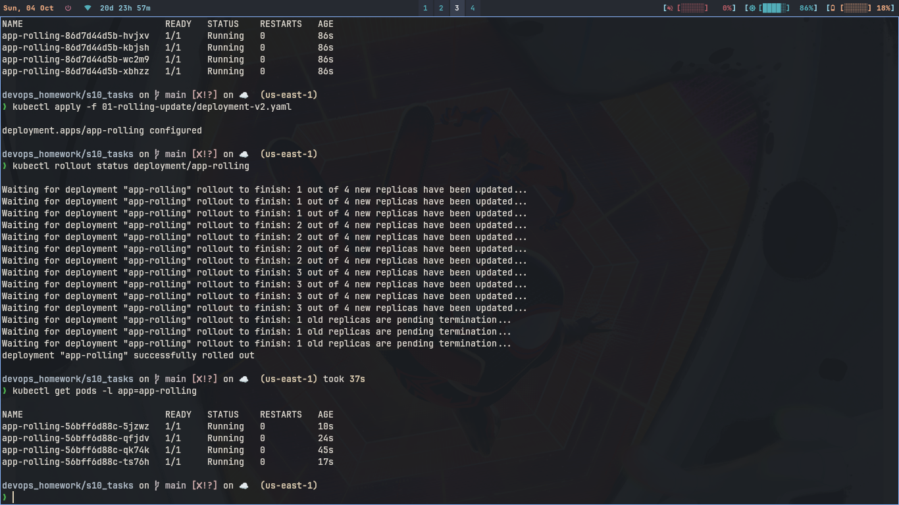
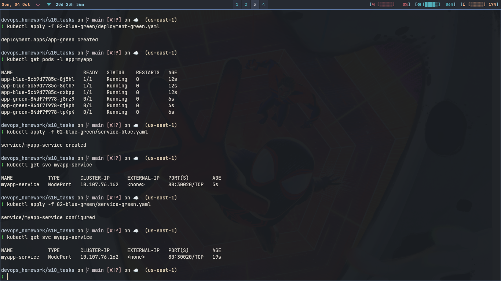
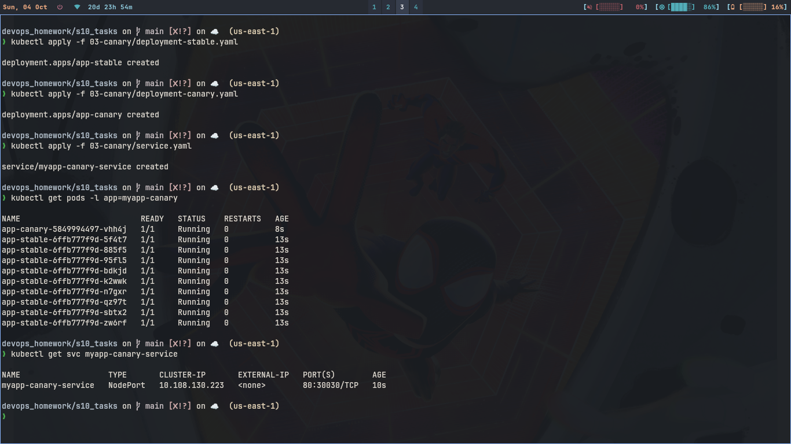
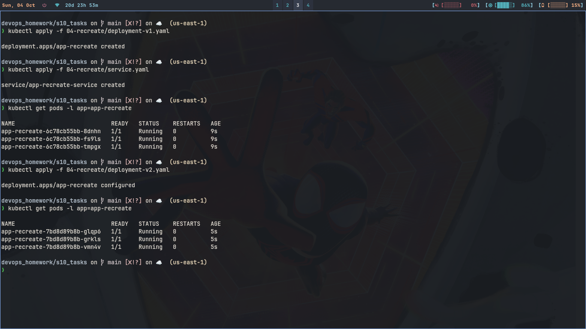
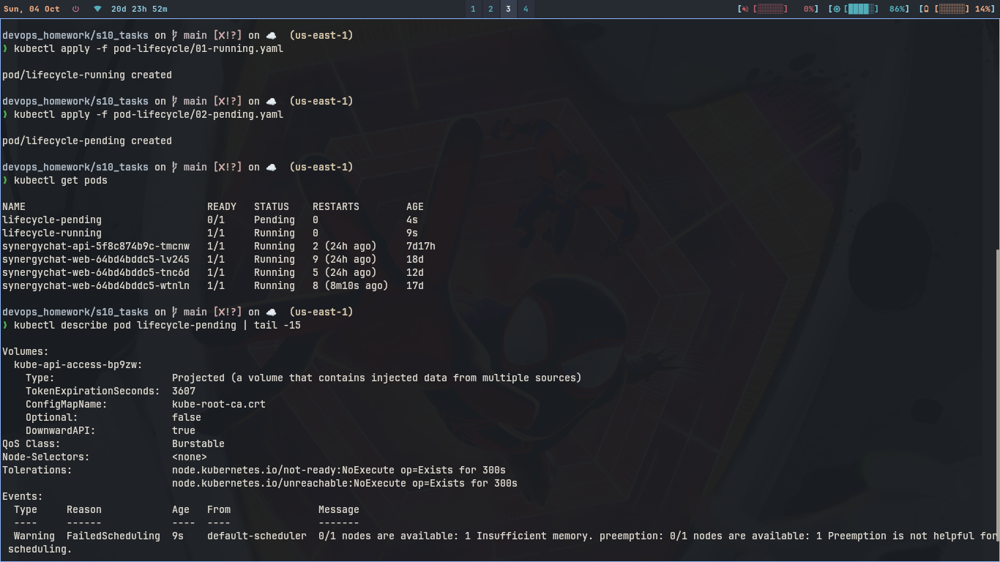
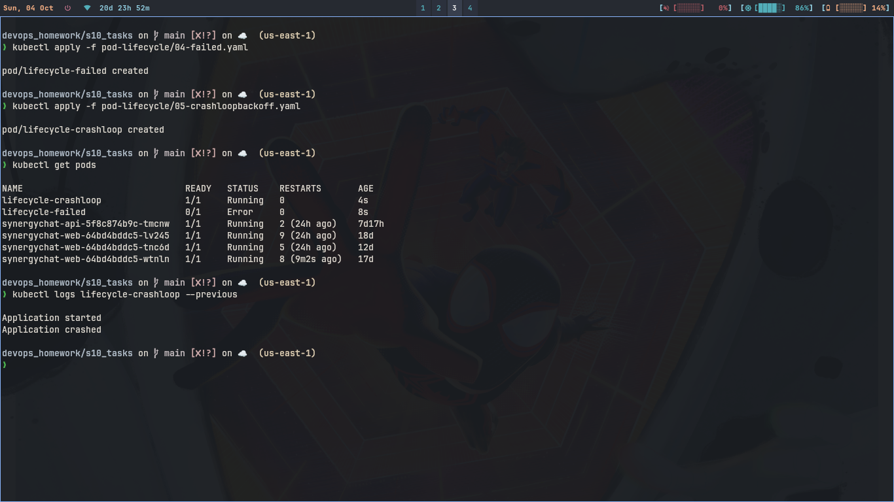
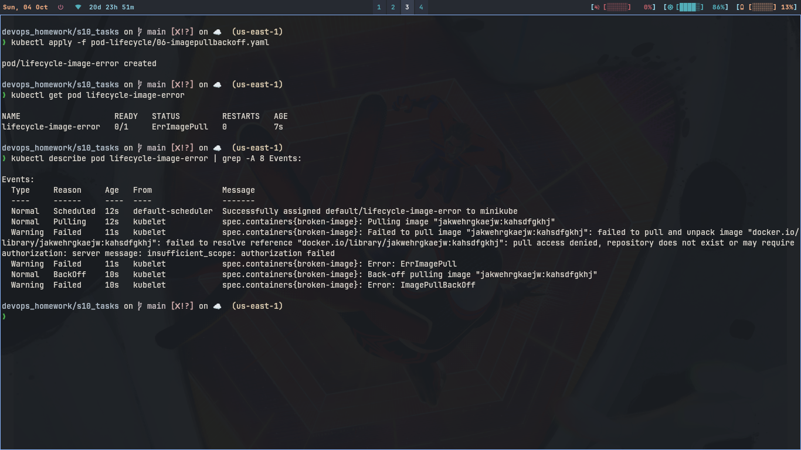

# Session 10: Kubernetes Pods, ReplicaSets & Deployments

## 1. Rolling Update

### Commands

```bash
kubectl apply -f 01-rolling-update/deployment-v1.yaml
kubectl apply -f 01-rolling-update/service.yaml
kubectl get pods -l app=app-rolling
kubectl apply -f 01-rolling-update/deployment-v2.yaml
kubectl rollout status deployment/app-rolling
kubectl get pods -l app=app-rolling
```

### What I understood:

```
Rolling update replaces old pods one by one. Old and new pods both run
for some time. Service keeps working, no downtime. maxSurge 1 and
maxUnavailable 0 means it never kills extra pods.
```

### Screenshot



---

## 2. Blue-Green Deployment

### Commands

```bash
kubectl apply -f 02-blue-green/deployment-blue.yaml
kubectl apply -f 02-blue-green/deployment-green.yaml
kubectl get pods -l app=myapp
kubectl apply -f 02-blue-green/service-blue.yaml
kubectl get svc myapp-service
kubectl apply -f 02-blue-green/service-green.yaml
kubectl get svc myapp-service
```

### What I understood:

```
Blue is v1 live version, green is v2 new version. Both run at same time.
Traffic switch happens by changing service selector from slot blue to
slot green. It is instant, rollback is just apply blue service again.
```

### Screenshot



---

## 3. Canary Deployment

### Commands

```bash
kubectl apply -f 03-canary/deployment-stable.yaml
kubectl apply -f 03-canary/deployment-canary.yaml
kubectl apply -f 03-canary/service.yaml
kubectl get pods -l app=myapp-canary
kubectl get svc myapp-canary-service
```

### What I understood:

```
Stable has 9 pods v1, canary has 1 pod v2. Same service selects both,
so most traffic goes to stable and little traffic goes to canary.
If canary looks fine we scale it up, else delete it.
```

### Screenshot



---

## 4. Recreate Deployment

### Commands

```bash
kubectl apply -f 04-recreate/deployment-v1.yaml
kubectl apply -f 04-recreate/service.yaml
kubectl get pods -l app=app-recreate
kubectl apply -f 04-recreate/deployment-v2.yaml
kubectl get pods -l app=app-recreate -w
```

### What I understood:

```
Recreate kills all old pods first, then creates new pods. So for some
time there are 0 pods and site goes down. It is simple but has downtime,
good when both versions can not run together.
```

### Screenshot



---

## 5. Pod Lifecycle

For each yaml file I did apply, then check status, then check details.

### 5.1 Running

```bash
kubectl apply -f pod-lifecycle/01-running.yaml
kubectl get pod lifecycle-running
kubectl describe pod lifecycle-running
```

```
It came in Running state. Means container started fine with nginx image.
```

### 5.2 Pending

```bash
kubectl apply -f pod-lifecycle/02-pending.yaml
kubectl get pod lifecycle-pending
kubectl describe pod lifecycle-pending
```

```
It stayed in Pending. Describe showed it is asking 9Gi memory which
minikube can not give, so scheduler did not place it.
```

### Screenshot



### 5.3 Failed

```bash
kubectl apply -f pod-lifecycle/04-failed.yaml
kubectl get pod lifecycle-failed
kubectl logs lifecycle-failed
```

```
It ran busybox command and exit 1, so pod went to Error then Failed.
restartPolicy is Never so it did not restart.
```

### 5.4 CrashLoopBackOff

```bash
kubectl apply -f pod-lifecycle/05-crashloopbackoff.yaml
kubectl get pod lifecycle-crashloop
kubectl logs lifecycle-crashloop --previous
```

```
Same exit 1 but restart is default Always, so it keeps restarting
and goes in CrashLoopBackOff with backoff delay.
```

### Screenshot



### 5.5 ImagePullBackOff

```bash
kubectl apply -f pod-lifecycle/06-imagepullbackoff.yaml
kubectl get pod lifecycle-image-error
kubectl describe pod lifecycle-image-error
```

```
Image name is wrong so kubelet can not pull it. It shows ErrImagePull
first then ImagePullBackOff. Pod yaml is accepted but container never runs.
```

### Screenshot


