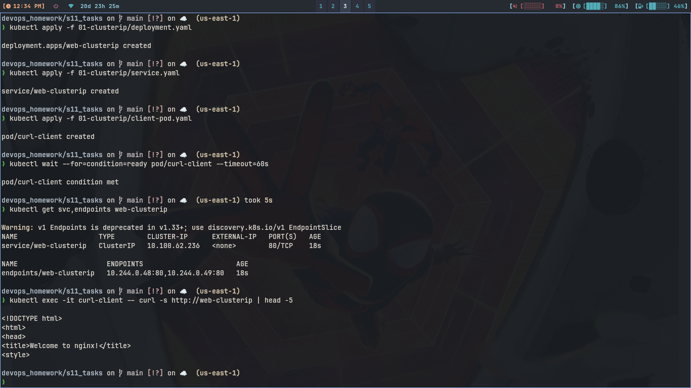
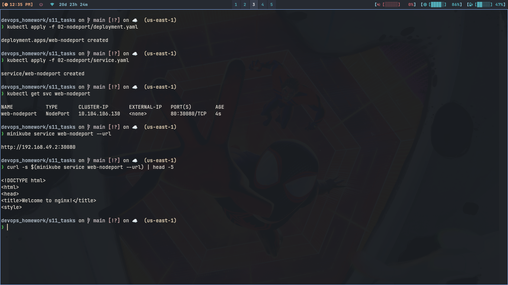
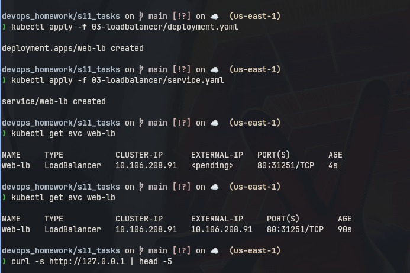
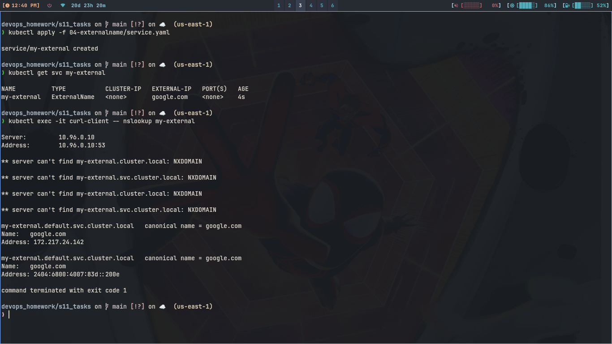
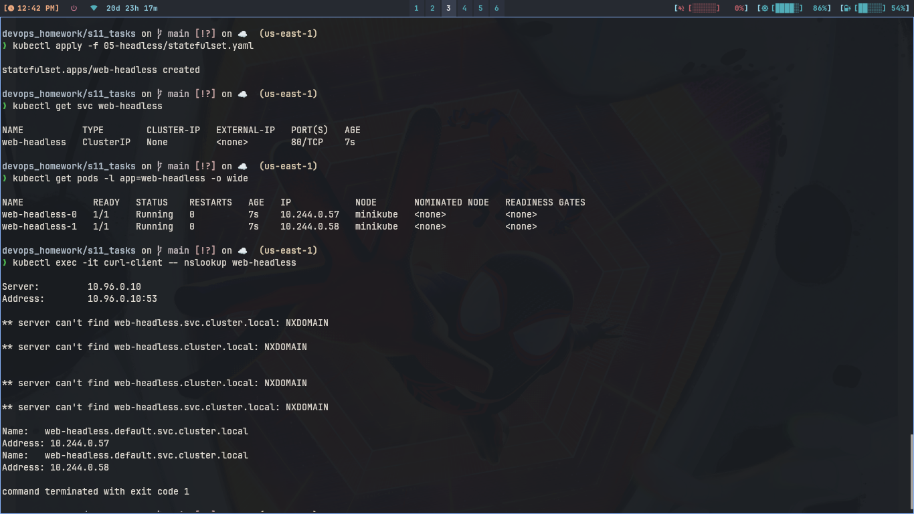

# Session 11: Kubernetes Networking & Services

## 1. ClusterIP

### Commands

```bash
kubectl apply -f 01-clusterip/deployment.yaml
kubectl apply -f 01-clusterip/service.yaml
kubectl get svc web-clusterip
kubectl get endpoints web-clusterip
kubectl apply -f 01-clusterip/client-pod.yaml
kubectl exec -it curl-client -- curl -s http://web-clusterip | head -5
```

### What I understood:

```
ClusterIP is default and only works inside cluster. It gives one virtual
IP and kube-proxy sends traffic to pods. I tested from curl-client pod
using service name and it returned nginx page.
```

### Screenshot



---

## 2. NodePort

### Commands

```bash
kubectl apply -f 02-nodeport/deployment.yaml
kubectl apply -f 02-nodeport/service.yaml
kubectl get svc web-nodeport
minikube service web-nodeport --url
curl $(minikube service web-nodeport --url)
```

### What I understood:

```
NodePort opens same port 30080 on every node. So we can access app
from outside cluster using node ip and that port. On minikube docker
driver direct node ip does not work, so I used minikube service --url.
```

### Screenshot



---

## 3. LoadBalancer

### Commands

```bash
kubectl apply -f 03-loadbalancer/deployment.yaml
kubectl apply -f 03-loadbalancer/service.yaml
kubectl get svc web-lb
minikube tunnel
kubectl get svc web-lb
curl http://127.0.0.1
```

### What I understood:

```
LoadBalancer is for cloud. It makes its own ClusterIP and NodePort
also. On minikube EXTERNAL-IP stays pending until we run minikube
tunnel in second terminal, then it gets 127.0.0.1 and works on port 80.
```

### Screenshot



---

## 4. ExternalName

### Commands

```bash
kubectl apply -f 04-externalname/service.yaml
kubectl get svc my-external
kubectl exec -it curl-client -- nslookup my-external
```

### What I understood:

```
ExternalName has no ClusterIP and no endpoints. It is just a CNAME
to google.com. Inside pod nslookup returns google.com address.
Useful when app wants short name instead of full external domain.
```

### Screenshot



---

## 5. Headless

### Commands

```bash
kubectl apply -f 05-headless/service.yaml
kubectl apply -f 05-headless/statefulset.yaml
kubectl get svc web-headless
kubectl get pods -l app=web-headless
kubectl exec -it curl-client -- nslookup web-headless
```

### What I understood:

```
Headless means clusterIP None. So no virtual IP, DNS returns pod IPs
directly. StatefulSet pods are web-headless-0, 1 with stable names.
Good for database like mysql where each pod needs own address.
```

### Screenshot



---

## 6. Comparison

### Deployment vs ReplicaSet

```
Deployment manages ReplicaSet, ReplicaSet manages pods. ReplicaSet only
keeps replica count same. Deployment also does rolling updates and
rollback. Scaling in both is change replicas, but only deployment
remembers revisions. Relation is deployment -> replicaset -> pods.
```

### Deployment vs DaemonSet vs StatefulSet

| Point | Deployment | StatefulSet | DaemonSet |
| --- | --- | --- | --- |
| Use for | web apps, api | database, kafka | log agent on every node |
| Pod name | random hash | web-0, web-1 fixed | one per node |
| Scaling | any number | adds at end only | auto when node comes |
| Networking | normal ClusterIP | needs headless service | host or ClusterIP |
| Storage | shared or emptyDir | own PVC per pod | hostPath |
| Example | nginx, flask | mysql, mongo | fluentd, node-exporter |

### ReplicaSet vs Service

```
ReplicaSet keeps pods alive and same count. Service gives stable IP
and DNS to reach those pods. Pod IPs keep changing so we need service.
Traffic goes client -> service ClusterIP -> kube-proxy -> one of the
pods selected by label selector.
```

Details on DNS are in fqdn/README.md and coredns/README.md.
