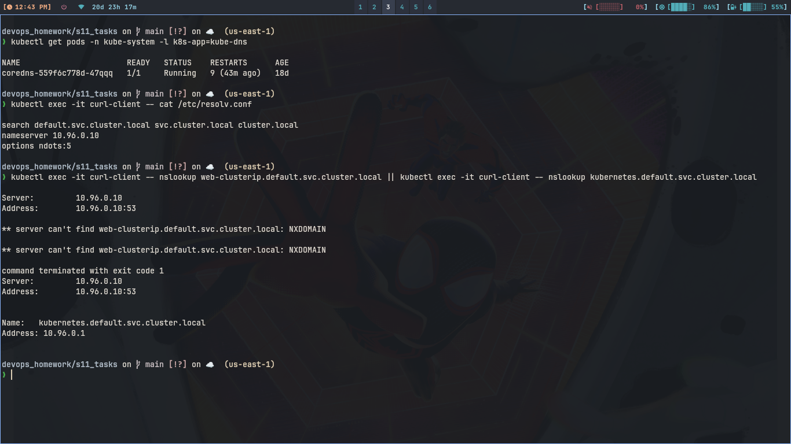

# FQDN

## What is FQDN?

```
FQDN means full address. Inside same room we say just name, but for
post we need full address. Same here, short name works in same
namespace, full name needed otherwise.
```

## Kubernetes Service DNS

```
Every service gets DNS from CoreDNS. Pod can curl service name
instead of IP because CoreDNS resolves it.
```

## DNS naming convention

```
<service>.<namespace>.svc.cluster.local
Example: web-clusterip.default.svc.cluster.local
```

## Namespace based DNS

```
If both pods in default, curl http://web-clusterip works.
If pod is in other namespace, need curl http://web-clusterip.default
or full FQDN, else it looks in own namespace and fails.
```

## Pod to Service communication

```bash
kubectl exec -it curl-client -- cat /etc/resolv.conf
kubectl exec -it curl-client -- nslookup web-clusterip
kubectl exec -it curl-client -- nslookup web-clusterip.default.svc.cluster.local
kubectl exec -it curl-client -- curl -s http://web-clusterip | head -5
```

```
resolv.conf has nameserver 10.96.0.10 which is CoreDNS. It also has
search list so short name expands to FQDN automatically.
```

### Screenshot


