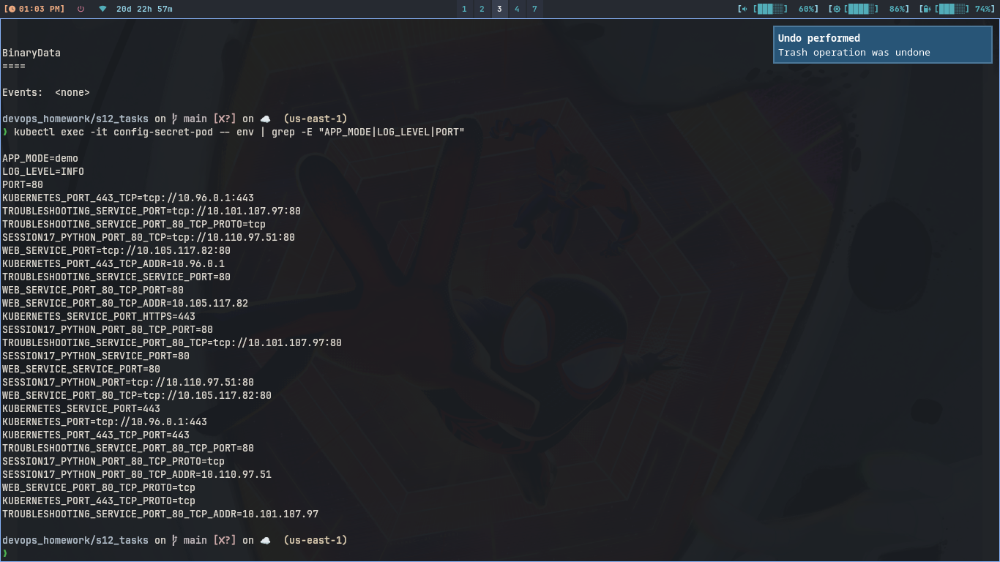
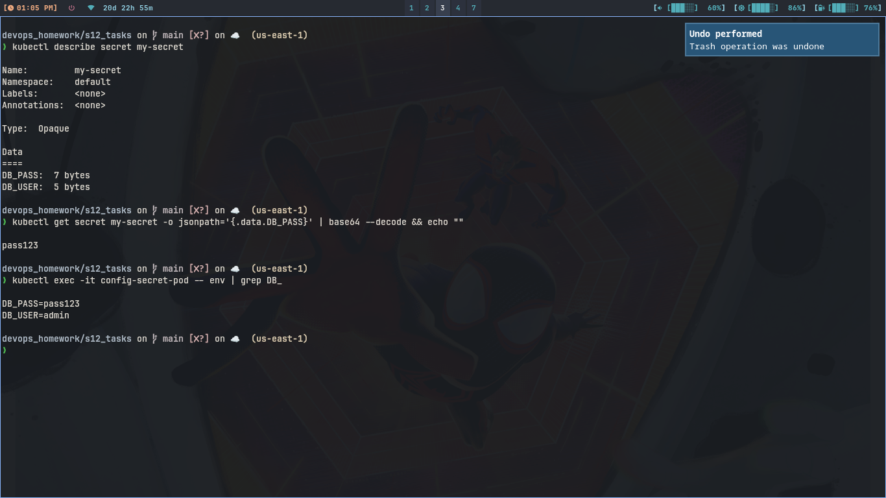
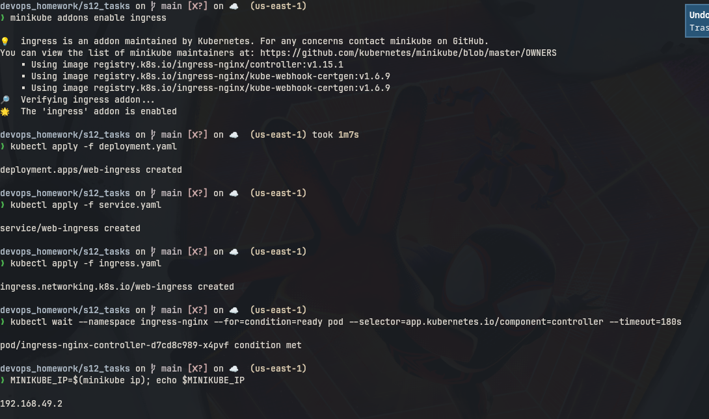
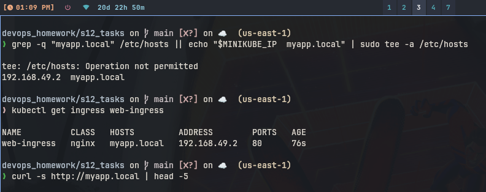
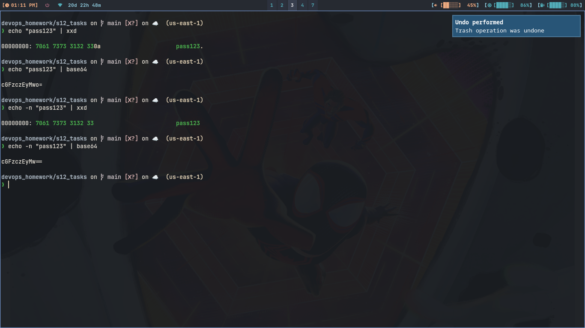

# Session 12: Kubernetes Ingress, ConfigMaps & Secrets

## 1. ConfigMap

### Commands

```bash
kubectl apply -f configmap.yaml
kubectl get configmap my-config
kubectl describe configmap my-config
kubectl apply -f pod.yaml
kubectl exec -it config-secret-pod -- env | grep -E "APP_MODE|LOG_LEVEL|PORT"
```

### What I understood:

```
ConfigMap stores plain settings like APP_MODE and LOG_LEVEL. Pod takes
them with envFrom configMapRef. Inside container env shows the values.
So image stays same, only config changes per env.
```

### Screenshot




---

## 2. Secret

### Commands

```bash
kubectl apply -f secret.yaml
kubectl get secret my-secret
kubectl describe secret my-secret
kubectl get secret my-secret -o jsonpath='{.data.DB_PASS}' | base64 --decode && echo ""
kubectl exec -it config-secret-pod -- env | grep DB_
```

### What I understood:

```
Secret stores passwords like DB_PASS. Describe hides values, only shows
bytes. Base64 is just encoding not encryption, anyone can decode it.
So we should not commit secret yaml to git, use vault or CI secrets.
```

### Screenshot



---

## 3. Ingress

### Commands

```bash
minikube addons enable ingress
kubectl apply -f deployment.yaml
kubectl apply -f service.yaml
kubectl apply -f ingress.yaml
kubectl get ingress web-ingress
curl http://myapp.local
```

### What I understood:

```
Ingress routes myapp.local / to web-ingress service. First I enabled
ingress addon and added minikube ip to /etc/hosts for myapp.local.
Curl returned nginx page, so routing works.
```

### Screenshot




---

## 4. Ingress vs Ingress Controller

```
Ingress is just rules yaml, it does nothing alone. It says host
myapp.local path / goes to service web-ingress.

Ingress controller is real pods running nginx that watch ingress rules
and route traffic. Without controller, ingress yaml is ignored.
We need both, one for rules and one to apply them.
```

---

## 5. Troubleshooting

### Commands

```bash
echo "pass123" | xxd
echo "pass123" | base64
echo -n "pass123" | xxd
echo -n "pass123" | base64
```

### What I understood:

```
Normal echo adds \n at end (0a in xxd). So base64 becomes wrong and db
says password failed. With echo -n there is no newline and base64 is
correct. Always use echo -n for secrets.
```

### Screenshot


