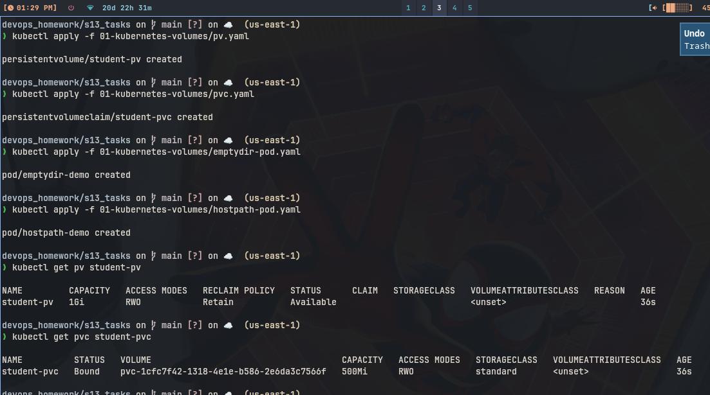
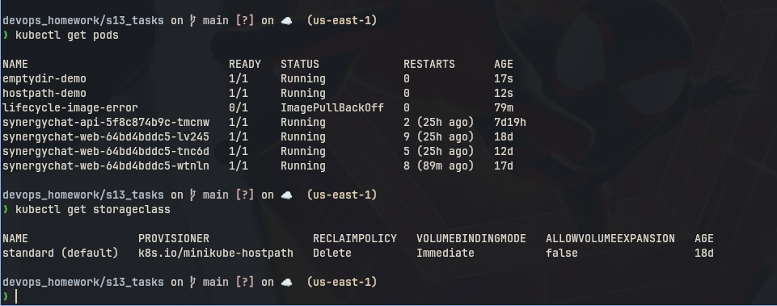

# Kubernetes Volumes

## emptyDir

```bash
kubectl apply -f emptydir-pod.yaml
kubectl get pod emptydir-demo
```

```
emptyDir is temp folder inside pod. Both containers can share it.
When pod dies data is gone. Good for cache or temp files.
See emptydir-pod.yaml, volume mountPath /data.
```

## hostPath

```bash
kubectl apply -f hostpath-pod.yaml
kubectl get pod hostpath-demo
```

```
hostPath uses node folder /tmp/hostpath-data. Data stays on node
even if pod restarts. But if pod goes to other node data is lost.
Only for single node testing, not real use.
```

## PersistentVolume

```
PV is storage made by admin. It lives apart from pods. Example
pv.yaml makes 1Gi hostPath /tmp/student-data with Retain policy.
```

```bash
kubectl apply -f pv.yaml
kubectl get pv student-pv
```

## PersistentVolumeClaim

```
PVC is request for storage by user. K8s binds PVC to free PV.
pvc.yaml asks 500Mi, it binds to student-pv above.
```

```bash
kubectl apply -f pvc.yaml
kubectl get pvc student-pvc
```

## StorageClass

```
StorageClass makes PV automatically, no need to make PV by hand.
We just make PVC with storageClassName and it provisions disk.
On minikube default standard class uses hostpath provisioner.
```

```bash
kubectl get storageclass
```

## Dynamic provisioning

```
Means PVC creates PV by itself using StorageClass. No admin step.
Mini project pvc.yaml works like this, it gets Bound without
making PV first.
```

### Screenshot




