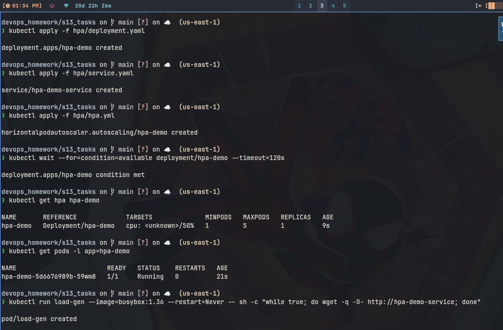
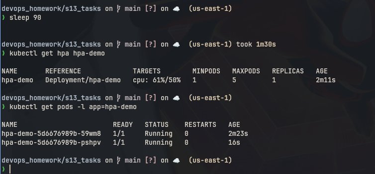
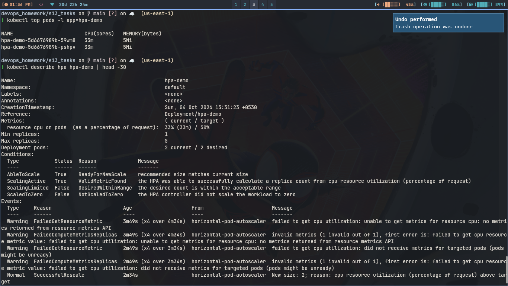
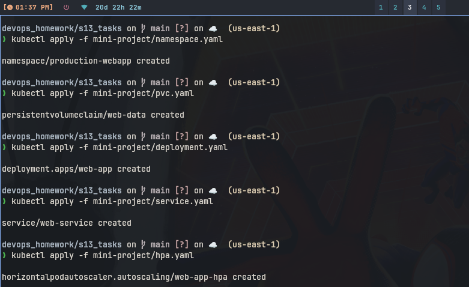
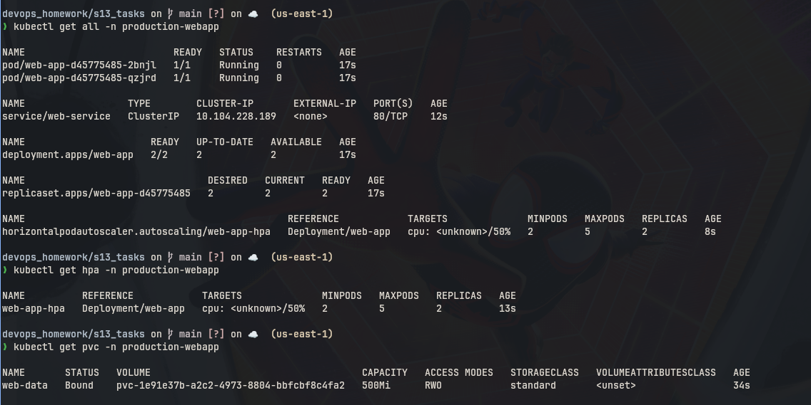

# Session 13: Kubernetes Storage, HPA & Probes

Volume notes are in 01-kubernetes-volumes/README.md.

## 1. HPA Hands-on

### Commands

```bash
minikube addons enable metrics-server
kubectl apply -f hpa/deployment.yaml
kubectl apply -f hpa/service.yaml
kubectl apply -f hpa/hpa.yml
kubectl get hpa hpa-demo
kubectl get pods -l app=hpa-demo
kubectl top pods
kubectl describe hpa hpa-demo
```

### Load generator

```bash
kubectl run load-gen --image=busybox:1.36 --restart=Never -- sh -c "while true; do wget -q -O- http://hpa-demo-service; done"
kubectl get hpa hpa-demo -w
kubectl get pods -l app=hpa-demo
kubectl top pods
kubectl delete pod load-gen
```

### What I understood:

```
HPA watches cpu and adds pods when load is high. Deployment has cpu
request 100m so HPA can count percent. At start 1 pod, after load it
went to more pods. top shows cpu going up. describe shows current
cpu percent and min 1 max 5.
```

### Screenshots






---

## 2. Mini Project

Files in mini-project/ folder: namespace.yaml, pvc.yaml, deployment.yaml,
service.yaml, hpa.yaml.

### Commands

```bash
kubectl apply -f mini-project/namespace.yaml
kubectl apply -f mini-project/pvc.yaml
kubectl apply -f mini-project/deployment.yaml
kubectl apply -f mini-project/service.yaml
kubectl apply -f mini-project/hpa.yaml
kubectl get all -n production-webapp
kubectl get hpa -n production-webapp
```

### What I understood:

```
Full app with own namespace production-webapp. PVC gives /data storage,
deployment has startup readiness liveness probes on /. Service is
ClusterIP and HPA keeps 2 to 5 pods on 50 percent cpu. It combines
storage plus probes plus HPA in one project.
```

### Screenshot




