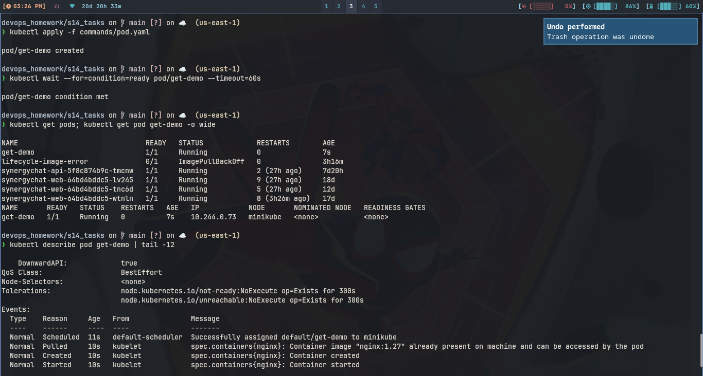
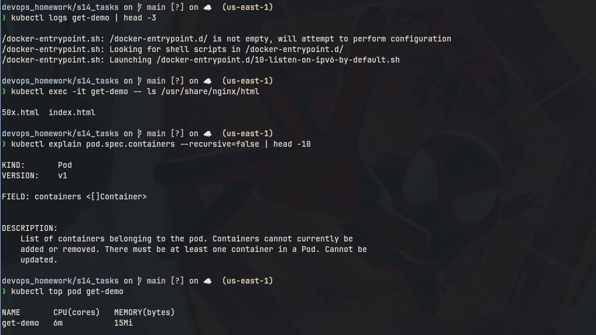
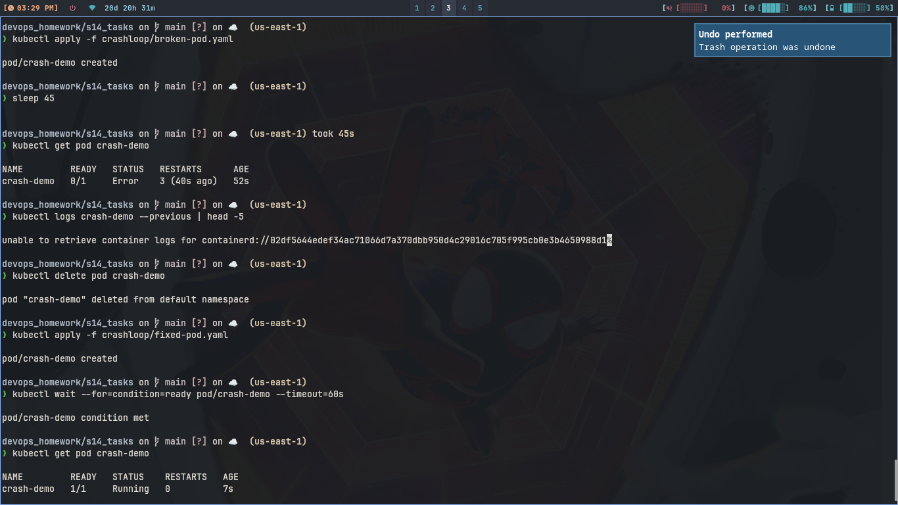
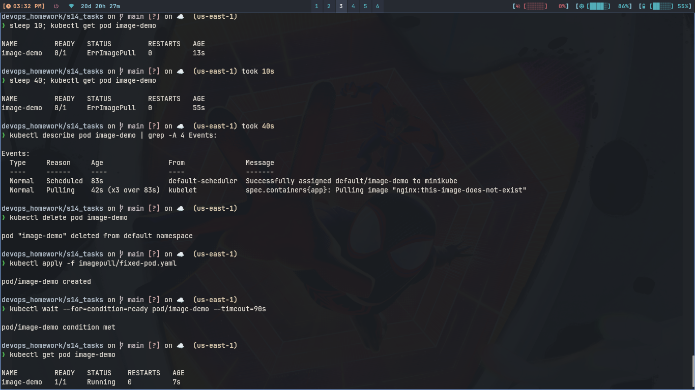
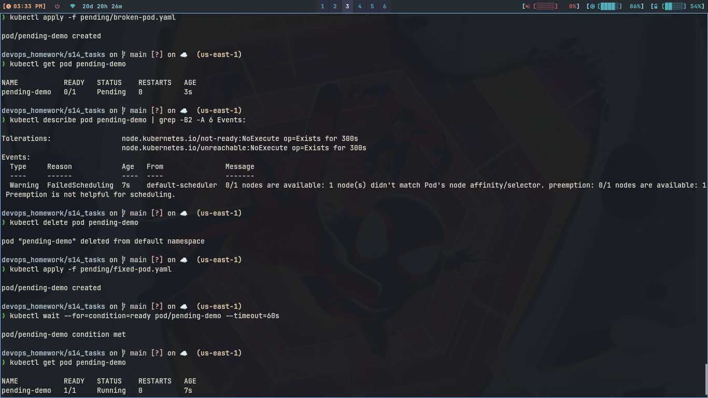
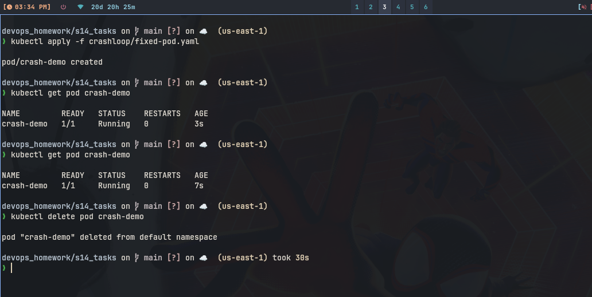
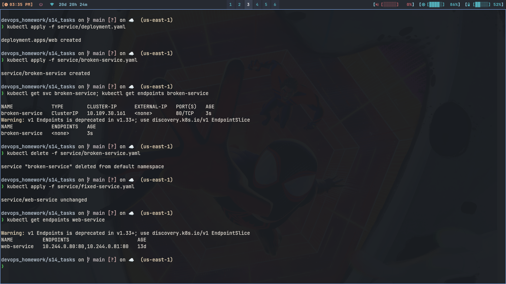
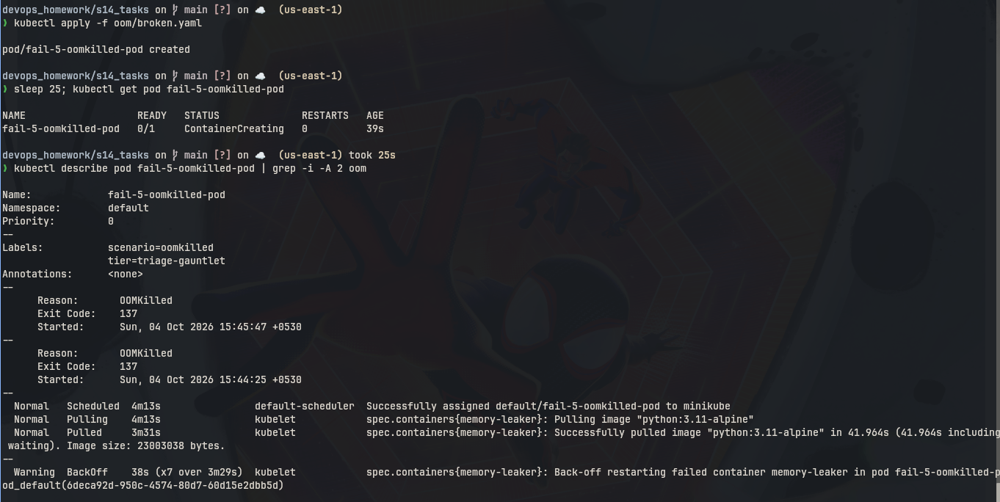
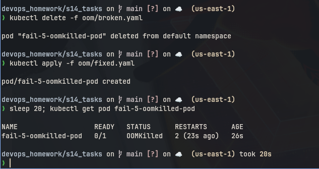
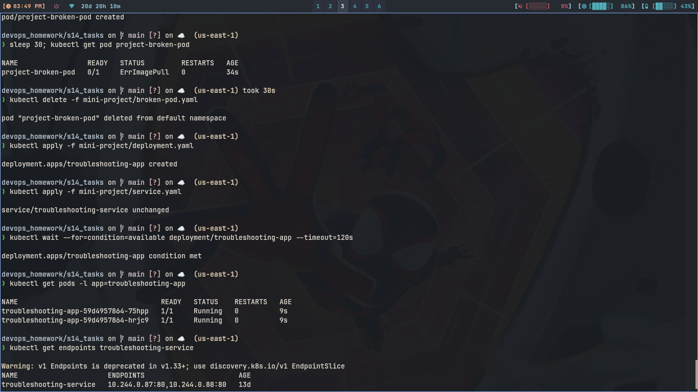

# Session 14: Kubernetes Troubleshooting

## 1. Kubernetes Commands

Used commands/pod.yaml (healthy nginx pod) for all of these.

### Commands

```bash
kubectl apply -f commands/pod.yaml
kubectl get pods
kubectl get pod get-demo -o wide
kubectl describe pod get-demo
kubectl logs get-demo
kubectl exec -it get-demo -- ls /usr/share/nginx/html
kubectl get events --sort-by=.lastTimestamp
kubectl explain pod.spec.containers
kubectl top pod get-demo
```

### What I understood:

```
get shows list, -o wide adds node and ips. describe shows full detail
plus events at bottom. logs shows container output. exec runs command
inside container. events shows cluster warnings. explain tells what
field means. top shows cpu memory, needs metrics-server.
```

### Screenshot




---

## 2. CrashLoopBackOff

### Commands

```bash
kubectl apply -f crashloop/broken-pod.yaml
kubectl get pod crash-demo
kubectl logs crash-demo --previous
kubectl delete pod crash-demo
kubectl apply -f crashloop/fixed-pod.yaml
kubectl get pod crash-demo
```

### What I understood:

```
Problem was app exits with code 1 every time. Kubelet restarts it again
and again with longer wait, that is CrashLoopBackOff. Logs showed
Something went wrong. Fix was healthy command with sleep 3600, then
pod stayed Running.
```

### Screenshot



---

## 3. ImagePullBackOff and ErrImagePull

Same demo covers both, ErrImagePull comes first then backoff.

### Commands

```bash
kubectl apply -f imagepull/broken-pod.yaml
kubectl get pod image-demo
kubectl get pod image-demo
kubectl describe pod image-demo
kubectl delete pod image-demo
kubectl apply -f imagepull/fixed-pod.yaml
kubectl get pod image-demo
```

### What I understood:

```
Image tag does not exist so kubelet can not pull. First get showed
ErrImagePull, second get showed ImagePullBackOff after retries.
Describe events had Failed to pull image. Fix was nginx:1.27 which
exists, then pod went Running.
```

### Screenshot



---

## 4. Pending

### Commands

```bash
kubectl apply -f pending/broken-pod.yaml
kubectl get pod pending-demo
kubectl describe pod pending-demo
kubectl delete pod pending-demo
kubectl apply -f pending/fixed-pod.yaml
kubectl get pod pending-demo
```

### What I understood:

```
Pod stayed Pending, never got node. Describe events said no node
matches nodeSelector node-that-does-not-exist. So scheduler could not
place it. Fix was removing nodeSelector, then it scheduled and ran.
```

### Screenshot



---

## 5. ContainerCreating

### Commands

```bash
kubectl apply -f crashloop/fixed-pod.yaml
kubectl get pod crash-demo
kubectl get pod crash-demo
kubectl delete pod crash-demo
```

### What I understood:

```
First get right after apply showed ContainerCreating while image was
pulling. Second get showed Running. So it is not an error, just a
short state. If it stays long, usually image pull is slow or volume
is mounting.
```

### Screenshot



---

## 6. Service Connectivity

### Commands

```bash
kubectl apply -f service/deployment.yaml
kubectl apply -f service/broken-service.yaml
kubectl get svc broken-service
kubectl get endpoints broken-service
kubectl delete -f service/broken-service.yaml
kubectl apply -f service/fixed-service.yaml
kubectl get endpoints web-service
```

### What I understood:

```
Problem was service selector app does-not-exist matches no pods, so
endpoints were <none> and curl failed. Root cause is label mismatch,
not network. Fix was selector app web which matches deployment, then
endpoints showed pod ips.
```

### Screenshot



---

## 7. Configuration Issues (OOMKilled)

### Commands

```bash
kubectl apply -f oom/broken.yaml
kubectl get pod fail-5-oomkilled-pod
kubectl describe pod fail-5-oomkilled-pod
kubectl delete -f oom/broken.yaml
kubectl apply -f oom/fixed.yaml
kubectl get pod fail-5-oomkilled-pod
```

### What I understood:

```
App allocates 200MB but limit was only 20Mi, so kernel killed it and
describe showed Reason OOMKilled. Root cause is limit lower than app
needs. Fix was raising limit to 300Mi in fixed.yaml, then pod ran.
```

### Screenshot




---

## 8. Mini Project

Files in mini-project/ folder: broken-pod.yaml, deployment.yaml, service.yaml.

### Commands

```bash
kubectl apply -f mini-project/broken-pod.yaml
kubectl get pod project-broken-pod
kubectl describe pod project-broken-pod
kubectl delete -f mini-project/broken-pod.yaml
kubectl apply -f mini-project/deployment.yaml
kubectl apply -f mini-project/service.yaml
kubectl get pods -l app=troubleshooting-app
kubectl get svc troubleshooting-service
kubectl get endpoints troubleshooting-service
```

### What I understood:

```
Broken pod used image tag that does not exist, so same ImagePullBackOff
as before. Deleted it and deployed healthy nginx with 2 replicas plus
ClusterIP service. Endpoints showed both pod ips, so full flow from
broken to fixed works.
```

### Screenshot


