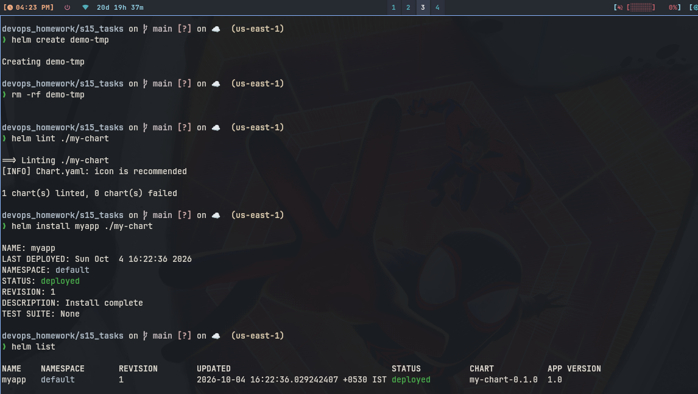
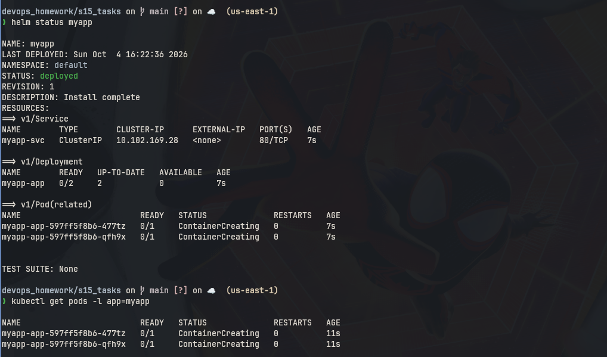
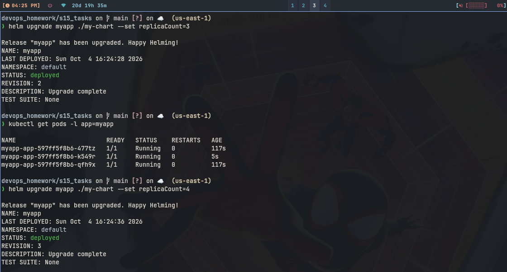
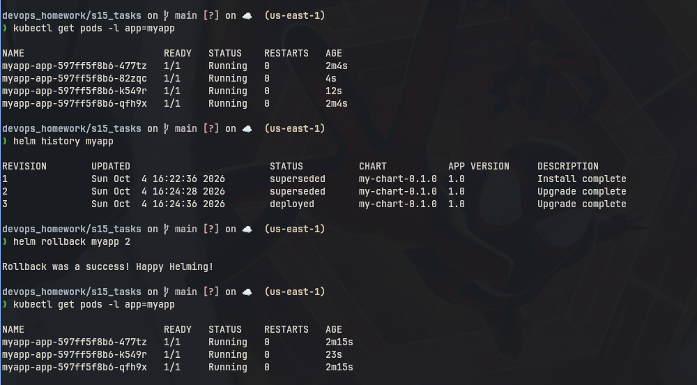
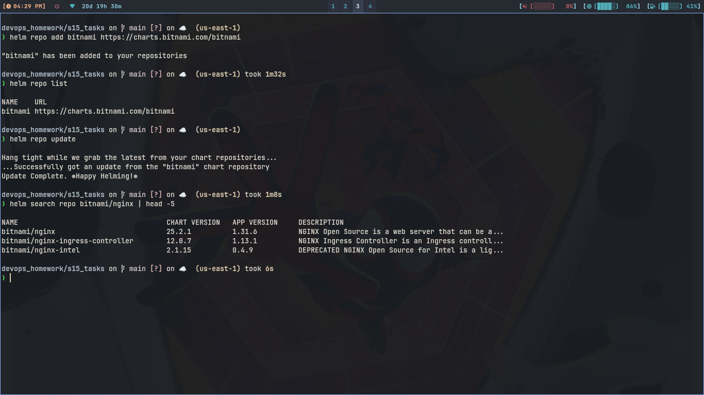
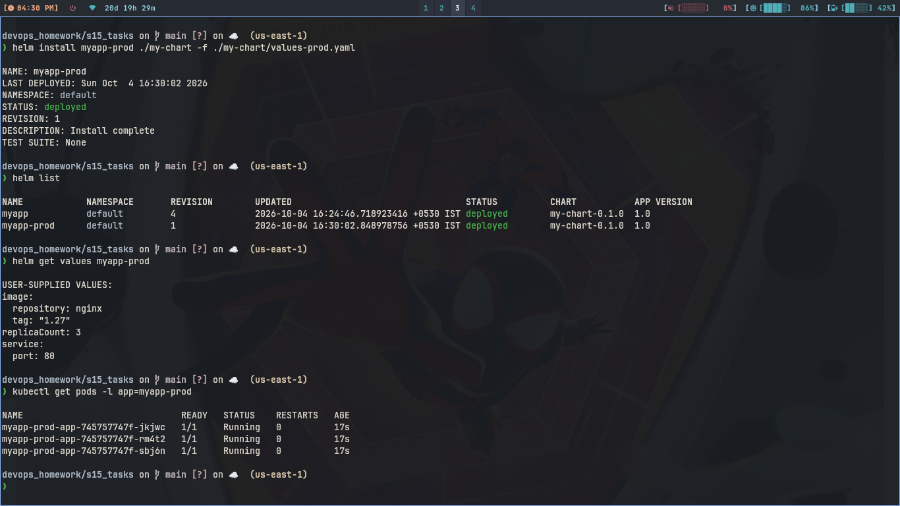

# Session 15: Helm

Chart used is my-chart/ folder: Chart.yaml, values.yaml, templates/
deployment.yaml and service.yaml. Same layout as helm create makes.

## 1. Helm Commands

### Commands

```bash
helm create demo-tmp
rm -rf demo-tmp
helm lint ./my-chart
helm install myapp ./my-chart
helm list
helm status myapp
helm get manifest myapp
helm get values myapp
kubectl get pods -l app=myapp
```

### What I understood:

```
create makes chart folder, lint checks it. install deploys it as
release myapp. list shows releases, status shows that release health.
get manifest shows applied yaml, get values shows replicaCount 2.
Chart values go into templates with {{ .Values }}.
```

### Screenshot




---

## 2. Helm Rollback

### Commands

```bash
helm upgrade myapp ./my-chart --set replicaCount=3
kubectl get pods -l app=myapp
helm upgrade myapp ./my-chart --set replicaCount=4
kubectl get pods -l app=myapp
helm history myapp
helm rollback myapp 2
kubectl get pods -l app=myapp
helm history myapp
```

### What I understood:

```
Install was revision 1 with 2 pods. First upgrade made revision 2
with 3 pods, second upgrade made revision 3 with 4 pods. history
showed all 3. rollback to 2 brought back 3 pods. So rollback just
reapplies old revision, nothing is lost.
```

### Screenshot





---

## 3. Helm Repo Commands

### Commands

```bash
helm repo add bitnami https://charts.bitnami.com/bitnami
helm repo list
helm repo update
helm search repo bitnami/nginx
```

### What I understood:

```
repo add saves chart repo link, list shows it. update pulls index.
search finds nginx chart in bitnami without installing. Same way we
could install ready charts instead of writing own.
```

### Screenshot



---

## 4. Mini Project

Used values-prod.yaml override file with same chart for second release.

### Commands

```bash
helm install myapp-prod ./my-chart -f ./my-chart/values-prod.yaml
helm list
helm get values myapp-prod
kubectl get pods -l app=myapp-prod
helm upgrade myapp-prod ./my-chart --set replicaCount=4
helm history myapp-prod
helm uninstall myapp-prod
helm uninstall myapp
helm list
```

### What I understood:

```
Same chart gave two releases, myapp with 2 replicas and myapp-prod
with 3 replicas and nginx 1.27 from values-prod file. Upgrade and
history worked same. Uninstall removed both and list became empty.
This is full chart plus values plus install upgrade rollback flow.
```

### Screenshot


