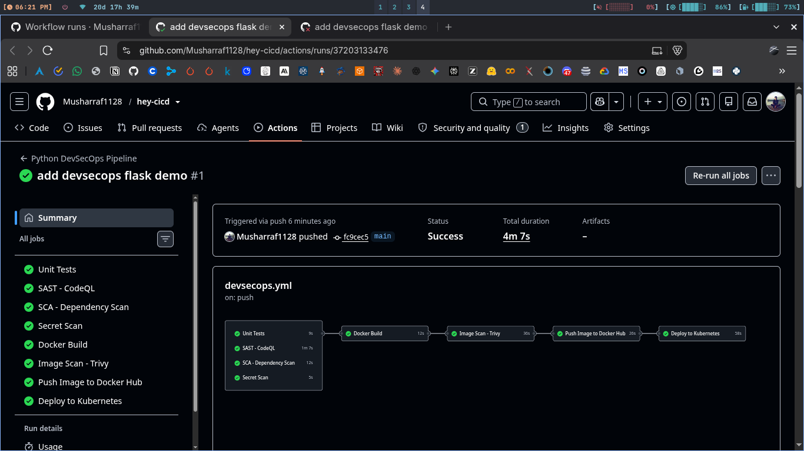
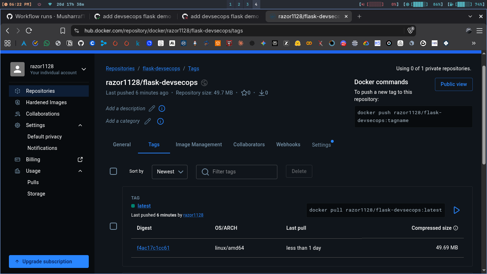
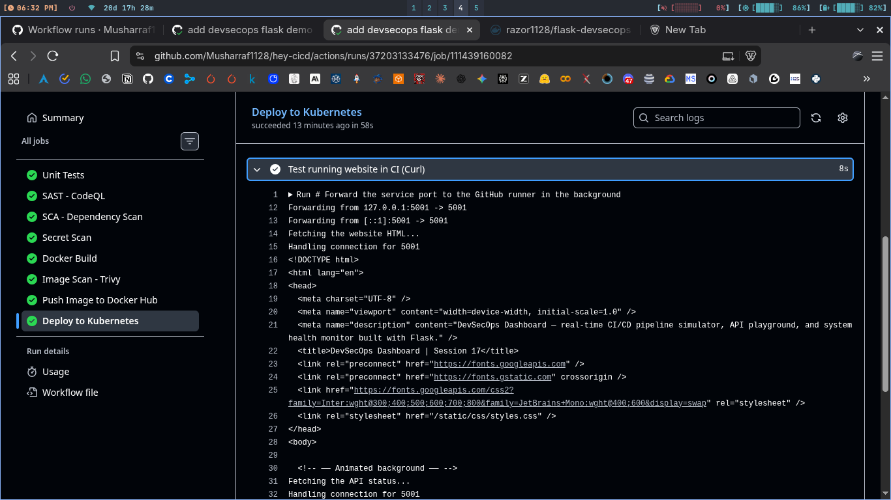

# Session 17: Complete CI/CD & DevSecOps

Flask app in app/ folder, tests in tests/ folder. Live demo runs in
separate repo https://github.com/Musharraf1128/hey-cicd in devsecops/
folder there. Exact copy of that live workflow is kept here in
s17_tasks/.github/workflows/devsecops.yml as proof.

Pipeline flow is Code -> Build -> Unit Test -> SAST -> SCA ->
Secret Scan -> Docker Build -> Image Scan -> Security Gate ->
Push Image -> Deploy to Kubernetes. Each job needs the one before,
so fail in any scan stops the image.

## 1. Build and Unit Test

### Commands (local check)

```bash
cd s17_tasks
pytest --cov=app --cov-report=term-missing
docker build -t flask-devsecops:local .
```

```
All 8 tests passed locally with coverage. Docker image built fine.
Same steps run in CI test and docker-build jobs.
```

## 2. Security Stages

```
SAST uses CodeQL init and analyze on python code. SCA installs
requirements and runs pip-audit for bad packages. Secret scan greps
for tokens keys and pem files. Image scan runs trivy on HIGH and
CRITICAL only. Gate is the needs chain, docker-build waits for all
4 checks, push waits for image scan.
```

### Screenshot



## 3. Push and Kind Deploy

```
Push job logins with DOCKERHUB_TOKEN secret and pushes
razor1128/flask-devsecops with sha and latest tags. Deploy job makes
a fresh Kind cluster inside CI, puts sha in deployment yaml, applies
manifests, checks rollout, then curls the site and /api/status through
port-forward. So we know the pushed image actually runs.
```

### Screenshots




