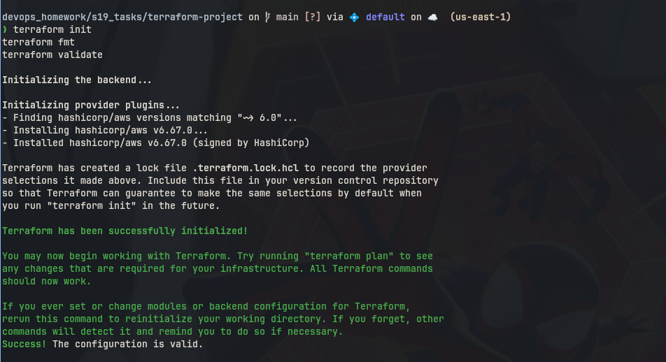
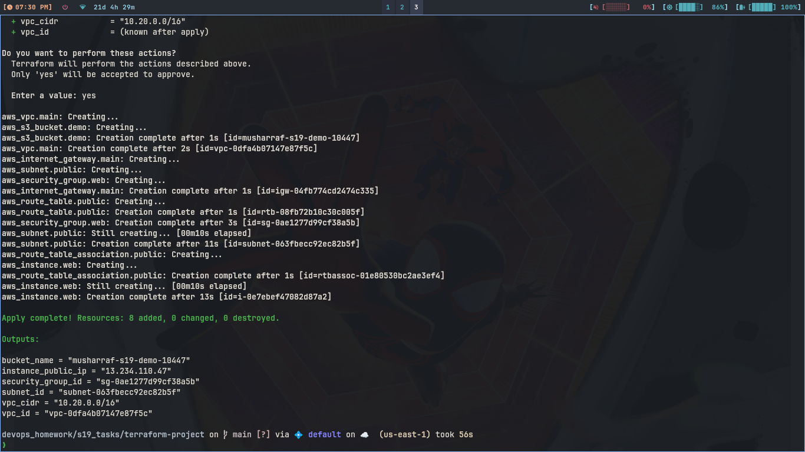
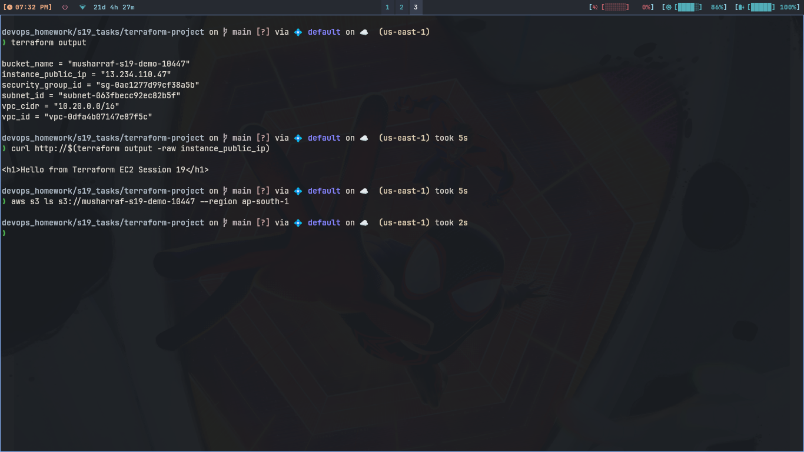
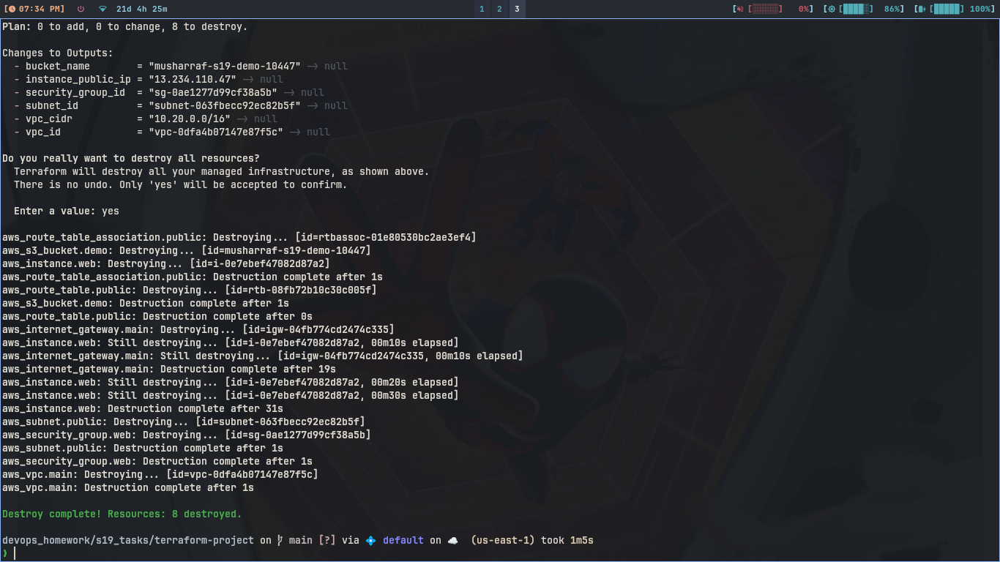

# Session 19: Cloud & Terraform in Action

Full VPC plus EC2 plus S3 project. Files are main.tf, variables.tf,
outputs.tf, provider.tf and terraform.tfvars. Region ap-south-1.

## Architecture

```
Internet
   |
[Internet Gateway] -- attached to VPC 10.20.0.0/16
   |
[Route Table] -- 0.0.0.0/0 goes to IGW
   |
[Public Subnet 10.20.1.0/24] -- gets public ips
   |
   +-- [EC2 t3.micro] -- nginx page, security group 80/443
   |
[Security Group] -- web box firewall

[S3 bucket] -- separate storage, no VPC needed
```

## Resources and Dependencies

```
VPC is first, everything needs vpc id. Subnet needs VPC. Internet
gateway needs VPC. Route table needs VPC plus gateway. Association
joins subnet and table. Security group needs VPC. EC2 needs subnet
plus security group plus AMI lookup. S3 bucket stands alone, only
needs globally unique name.
```

## 1. Init and Validate

### Commands

```bash
terraform init
terraform fmt
terraform validate
```

### What I understood:

```
init pulls aws provider 6.0. fmt aligns equals signs. validate parses
all files including EC2 user data block. State file is empty before
first apply.
```

### Screenshot



## 2. Plan and Apply

### Commands

```bash
terraform plan
terraform apply
```

### What I understood:

```
plan showed 9 to add, VPC subnet gateway table assoc group plus
instance and bucket. apply made all in order, subnet waited for VPC
and instance waited for subnet. Took few minutes for EC2 boot.
```

### Screenshot



## 3. Verify EC2 and Outputs

### Commands

```bash
terraform output
curl http://$(terraform output -raw instance_public_ip)
aws s3 ls s3://musharraf-s19-demo-10447 --region ap-south-1
```

### What I understood:

```
output gave vpc id plus instance public ip plus bucket name. curl on
that ip returned Hello from Terraform EC2 page, so user data nginx
worked. s3 ls showed empty new bucket. Both compute and storage live.
```

### Screenshot



## 4. Destroy

### Commands

```bash
terraform destroy
```

### What I understood:

```
destroy removed EC2 first then network then bucket. Typed yes once.
Always destroy same day, running EC2 costs money even t3.micro.
```

### Screenshot


