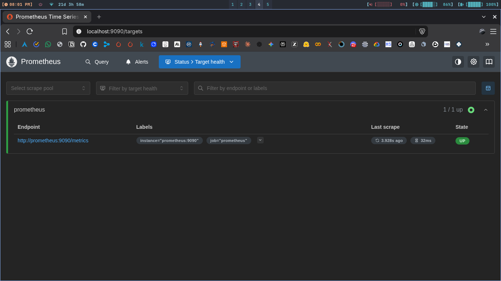
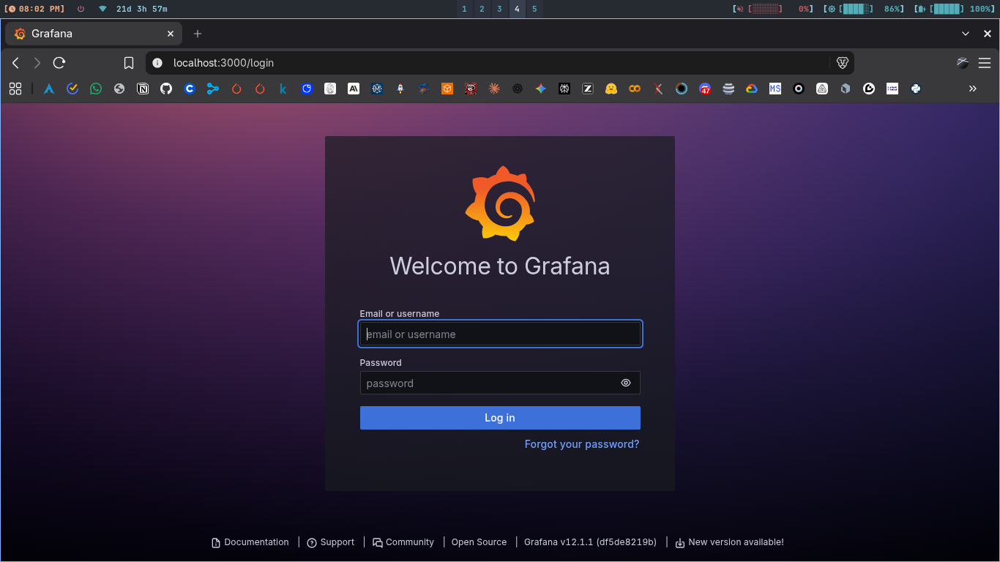
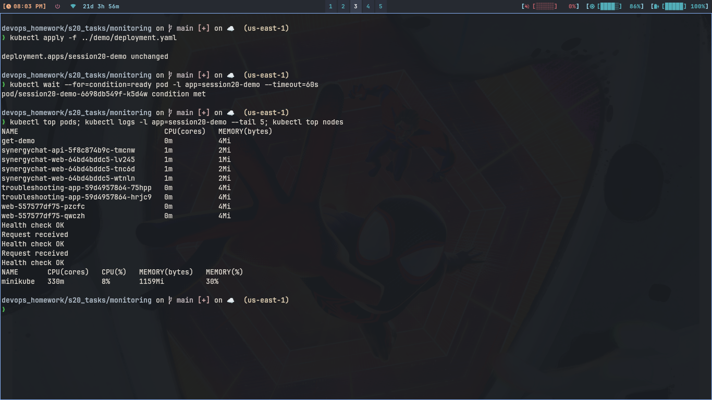
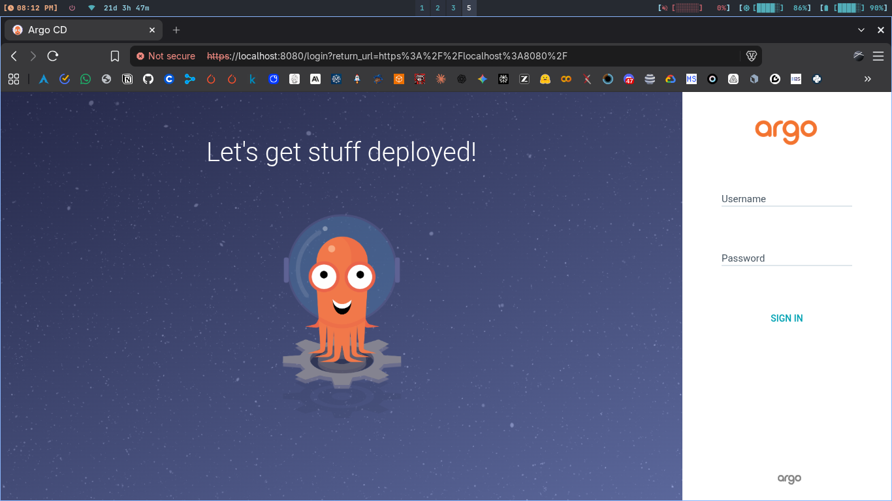
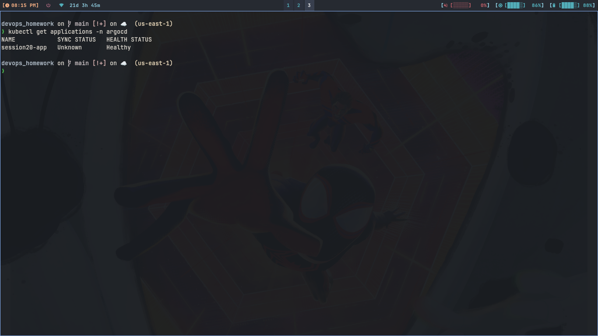

# Session 20: Monitoring, Observability & GitOps

## 1. Monitoring Demo

Prometheus collects numbers, Grafana draws them. Both run with one
compose file in monitoring/ folder.

### Commands

```bash
cd s20_tasks/monitoring
docker compose up -d
docker ps
curl -s http://localhost:9090/-/healthy
```

Open these in browser:

```
Prometheus targets: http://localhost:9090/targets
Grafana login: http://localhost:3000 (admin / admin)
```

```bash
kubectl apply -f ../demo/deployment.yaml
kubectl top pods
kubectl logs -l app=session20-demo --tail 5
kubectl top nodes
```

### What I understood:

```
Metrics are numbers over time like cpu percent. Logs are lines app
writes, here Request received lines. Alerts would fire when a number
crosses limit. top pods shows cpu memory live, logs shows health.
Prometheus targets page showed 1/1 UP, grafana opened with login.
```

### Screenshots







---

## 2. Observability

### Three Pillars

```
Metrics tell how much, like cpu 60 percent or 200 requests per min.
Logs tell what happened, one line per event with time. Traces follow
one request across services, showing which part was slow.
```

### Why Observability is Required

```
Without it we only know site is down from users. With it we see which
pod is hot, read its logs, and trace the slow call. So fix takes
minutes not hours.
```

### Common Tools

```
Metrics: Prometheus plus Grafana. Logs: Loki or ELK stack. Traces:
Jaeger or Tempo. Kubernetes: metrics-server for top, kube-state-metrics
for object counts.
```

## 3. GitOps

### What is GitOps?

```
Git is the single truth for cluster state. We never kubectl edit live
things. Change yaml, push, and a tool makes cluster match git.
```

### Declarative Config and Reconciliation

```
Yaml says what should exist, not steps to do it. Argo CD loops all
the time comparing git vs cluster. If someone edits live pods by
hand, selfHeal puts git version back.
```

### GitOps Workflow

```
You -> git push -> GitHub -> Argo CD sees change in 3 min ->
applies diff -> pods updated. Rollback is git revert plus push.
```

### Kubernetes plus GitOps

```
Cluster never touched directly after setup. Every app is an Argo CD
Application pointing at a folder in git. Same flow for 1 app or 100.
```

## 4. Argo CD Install and Demo App

### Commands

```bash
minikube start
kubectl create namespace argocd
kubectl apply -n argocd -f https://raw.githubusercontent.com/argoproj/argo-cd/stable/manifests/install.yaml
kubectl get pods -n argocd -w
```

```bash
kubectl -n argocd get secret argocd-initial-admin-secret -o jsonpath="{.data.password}" | base64 -d && echo
kubectl port-forward svc/argocd-server -n argocd 8080:443
```

Login at https://localhost:8080 with admin plus that password.

```bash
kubectl apply -f argocd-application.yaml
kubectl get applications -n argocd
kubectl get pods -n session20
```

### What I understood:

```
Argo CD runs 7 pods in argocd namespace. Application points at my own
repo path s20_tasks/gitops-app. After apply it made session20 namespace
and deployed 2 nginx pods by itself. UI showed Synced and Healthy.
```

### Screenshot



## 5. GitOps Scale by Commit

### Commands

```bash
kubectl get pods -n session20
```

Change replicas to 3 in gitops-app/deployment.yaml, then:

```bash
git add s20_tasks/gitops-app/deployment.yaml
git commit -m "scale session20 app to 3"
git push origin main
kubectl get pods -n session20 -w
kubectl get applications -n argocd
```

### What I understood:

```
No kubectl scale used. Pushed replicas 3 and Argo CD synced in a
minute, third pod came. Revert commit would scale back same way.
Git history is the deploy history.
```

### Screenshot


