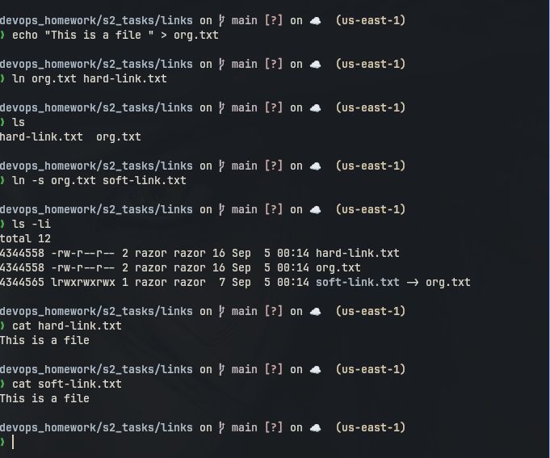
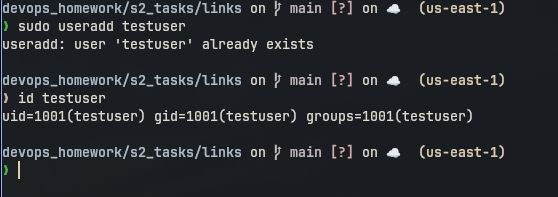
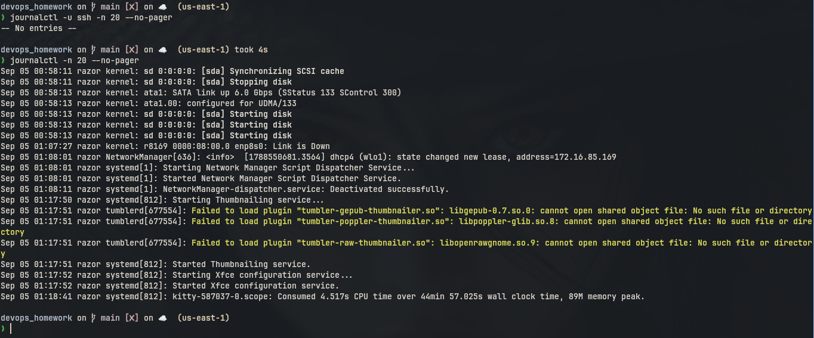
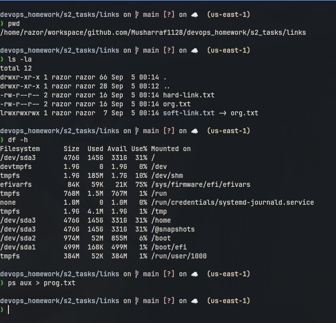

# Session 2: Linux Fundamentals Tasks

## 1. Soft Link & Hard Link

### Commands

```bash
mkdir links
cd links
echo "This is a file" > original.txt
ln original.txt hard-link.txt
ln -s original.txt soft-link.txt
ls -li
cat hard-link.txt
cat soft-link.txt
rm soft-link.txt
rm hard-link.txt
```

### What I understood:

```
Hard link points to the same inode as the original file. If original file is deleted,
hard link can still access the data. Soft link stores the path of original file.
If original file is deleted then soft link becomes broken.
```

### Screenshot



---

## 2. adduser vs useradd

### Commands

```bash
sudo adduser testuser
id testuser
sudo deluser --remove-home testuser
```

### What I understood:

```
useradd is a low level command. It creates the user but usually needs more options
for home directory, shell and password. adduser is more friendly on Ubuntu/Debian.
It asks questions and creates the home directory, so I prefer adduser.
```

### Screenshot



---

## 3. journalctl

### Commands

```bash
journalctl -n 20
journalctl -u ssh --no-pager
journalctl -u ssh -n 20 --no-pager
```

### What I understood:

```
journalctl is used to see system logs collected by systemd. We can use -u with a
service name to see logs only for that service. -n shows the last number of lines.
```

### Screenshot



---

## 4. Linux Command Cheat Sheet

| Command | Use |
| --- | --- |
| `pwd` | shows current directory |
| `ls -la` | lists files including hidden files |
| `cd` | changes directory |
| `mkdir` | creates directory |
| `touch` | creates an empty file |
| `cp` | copies files or folders |
| `mv` | moves or renames files |
| `rm` | removes files |
| `cat` | reads file content |
| `grep` | finds text in files |
| `chmod` | changes file permission |
| `df -h` | shows disk usage |
| `ps aux` | shows running processes |

### Screenshot


