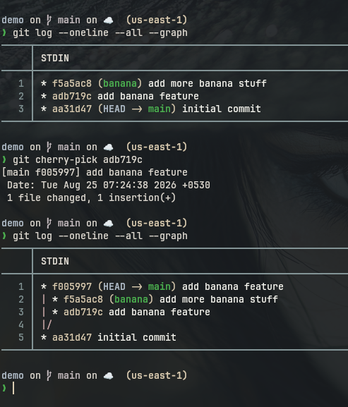
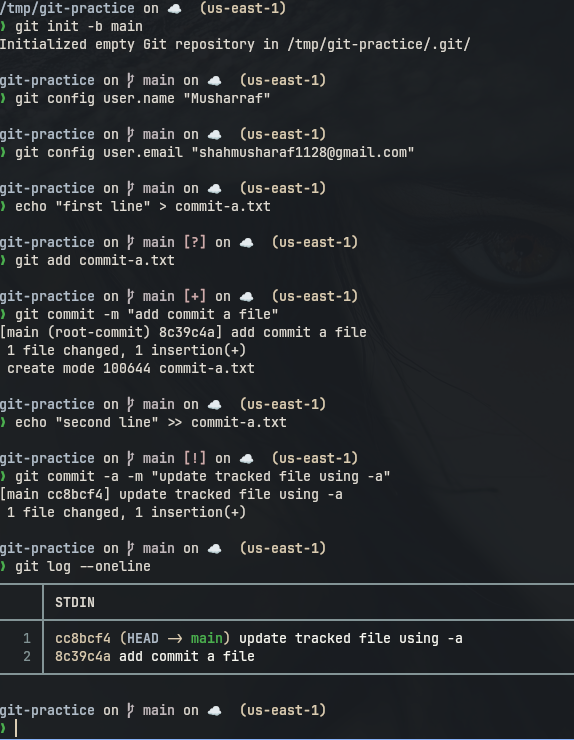

# Session: Git and GitHub

### git cherry-pick

```
used to add a specific commit to the current working branch
```

```



---

### git commit -a -m

```bash
git status
echo "first line" > commit-a.txt
git add commit-a.txt
git commit -m "add commit a file"

echo "second line" >> commit-a.txt
git commit -a -m "update tracked file using -a"
git log --oneline
```

```
git commit -m only commits files which are already staged using git add.
git commit -a -m automatically stages changes in already tracked files, but new
file still needs git add first.
```

### Screenshot



```


