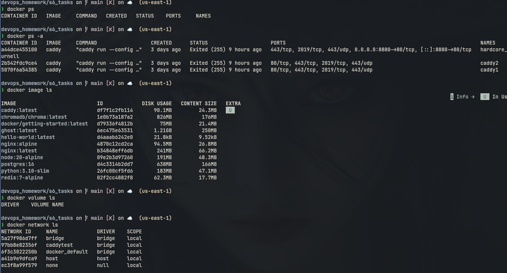
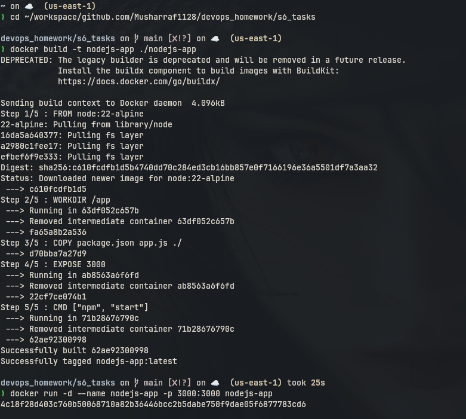
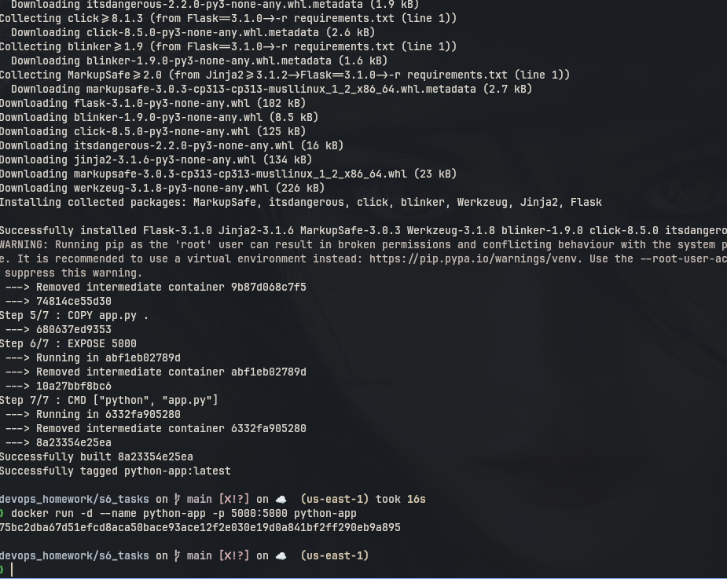
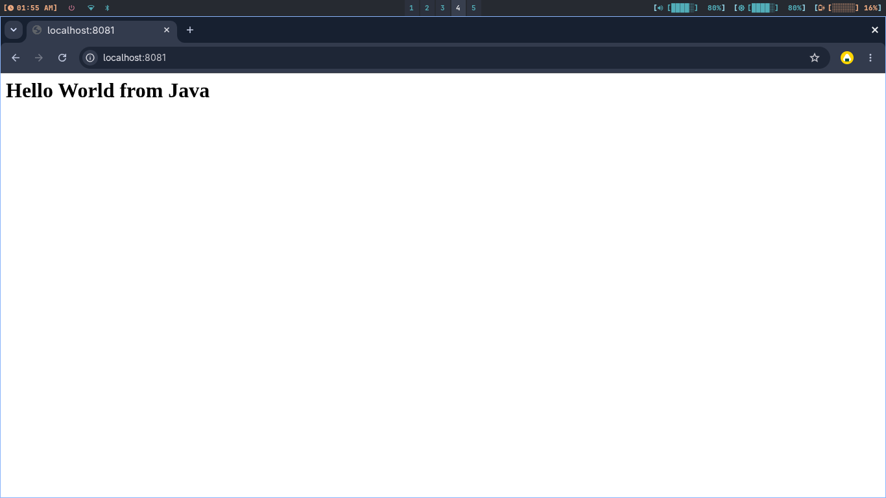
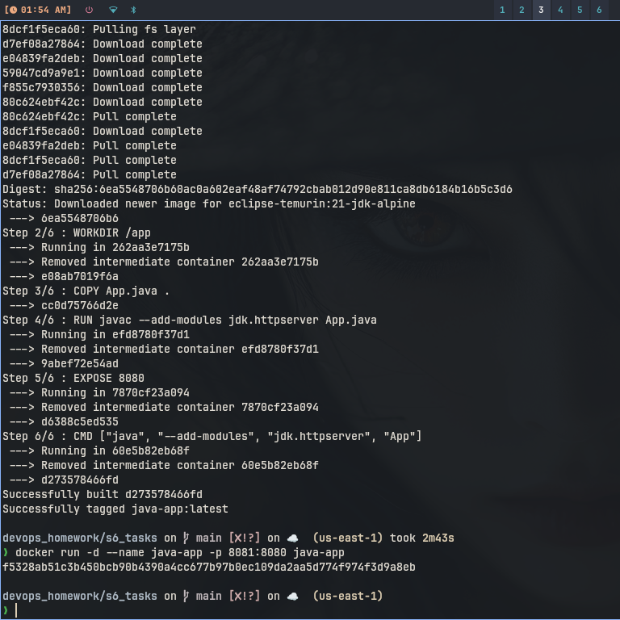
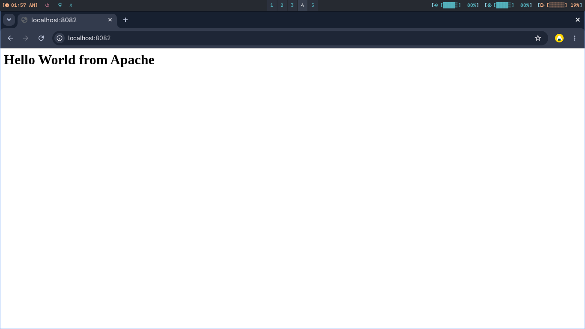
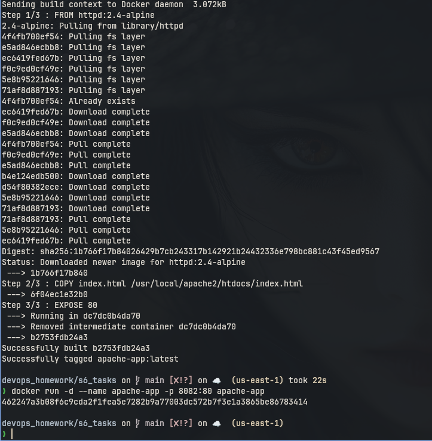
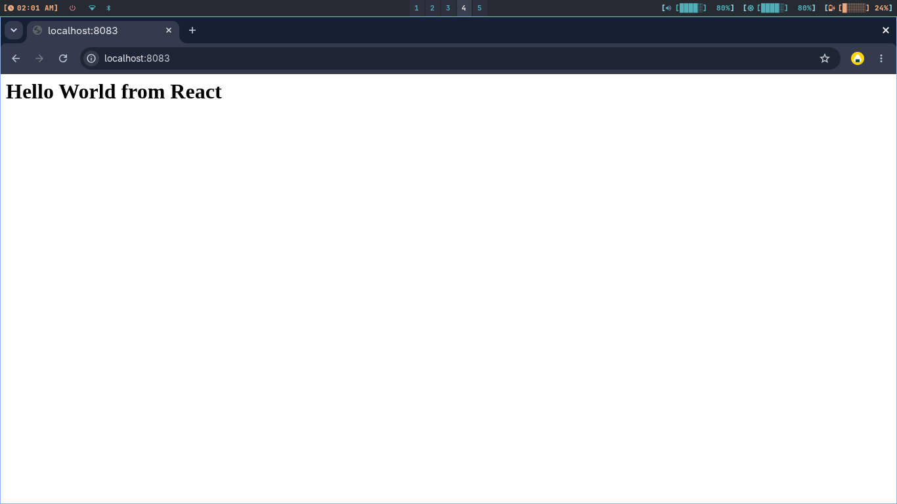
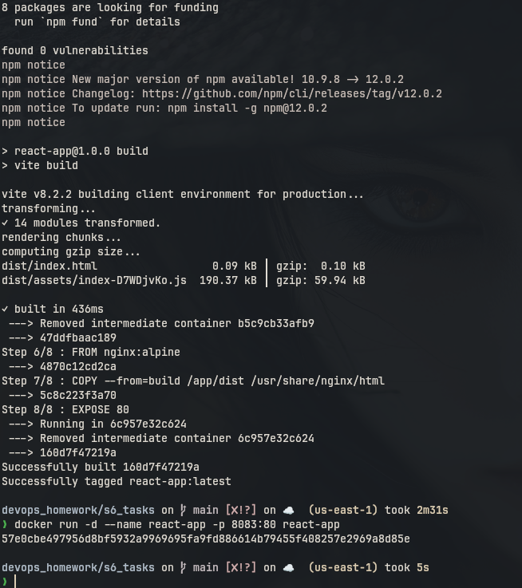
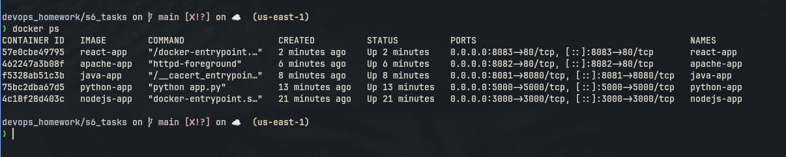

# Session 6: Docker

## Running nginx


## Basic Docker Commands




---

## Other Hello World Applications

I first practiced nginx above. For this homework I also made the other folders.

```text
nodejs-app
python-app
java-app
Apache-app
React-app
nginx-app
```

```bash
docker build -t nodejs-app ./nodejs-app
docker run -d --name nodejs-app -p 3000:3000 nodejs-app

docker build -t python-app ./python-app
docker run -d --name python-app -p 5000:5000 python-app

docker build -t java-app ./java-app
docker run -d --name java-app -p 8081:8080 java-app

docker build -t apache-app ./Apache-app
docker run -d --name apache-app -p 8082:80 apache-app

docker build -t react-app ./React-app
docker run -d --name react-app -p 8083:80 react-app

docker build -t nginx-app ./nginx-app
docker run -d --name nginx-app -p 8084:80 nginx-app

docker ps
```

### Node.js Screenshot




### Python Screenshot



### Java Screenshot





### Apache Screenshot





### React Screenshot





### Running Containers




