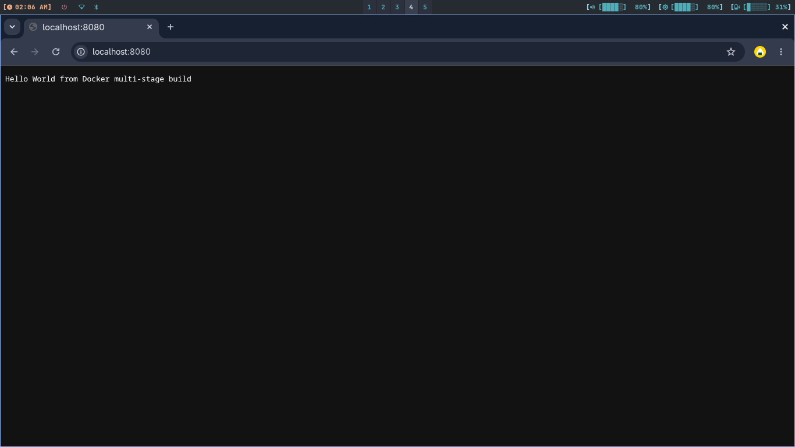
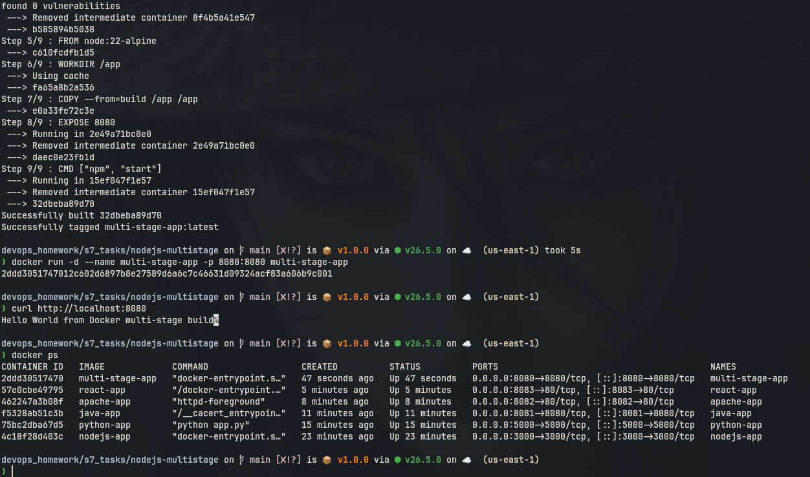
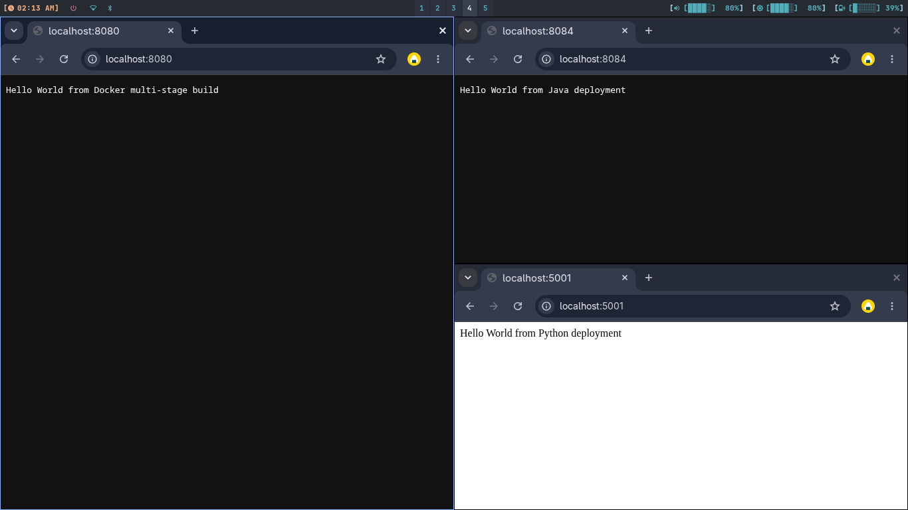
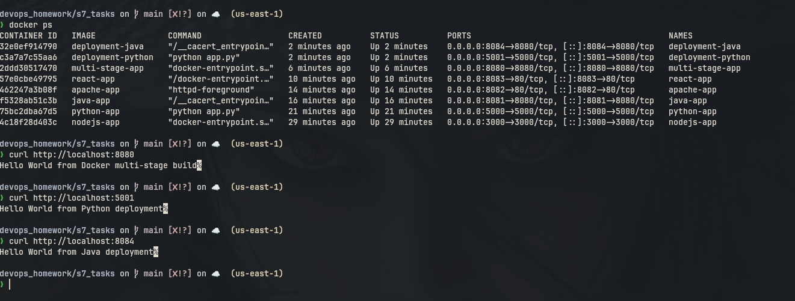

# Session 7: Dockerfiles & Images

## 1. Multi-Stage Dockerfile

### Commands

```bash
cd nodejs-multistage
docker build -t multi-stage-app .
docker run -d --name multi-stage-app -p 8080:8080 multi-stage-app
docker ps
curl http://localhost:8080
```

### Expected Output

```text
Hello World from Docker multi-stage build
```

### Screenshots





---

## 2. Documentation

Name: Musharraf

Enrollment Number: 10447

The required application and docker ps outputs will be added as screenshots above.

---

## 3. Docker Application Deployment

### Commands

```bash
docker build -t deployment-node ./nodejs-multistage
docker run -d --name deployment-node -p 8080:8080 deployment-node

docker build -t deployment-python ./python-app
docker run -d --name deployment-python -p 5001:5000 deployment-python

docker build -t deployment-java ./java-app
docker run -d --name deployment-java -p 8081:8080 deployment-java
```

### Screenshots

The multi-stage container above provides the Node.js deployment on port 8080.




