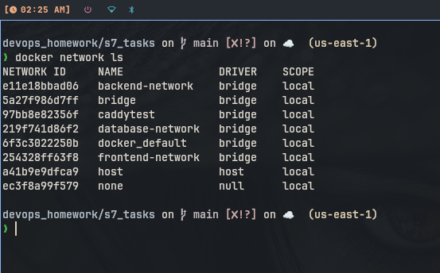
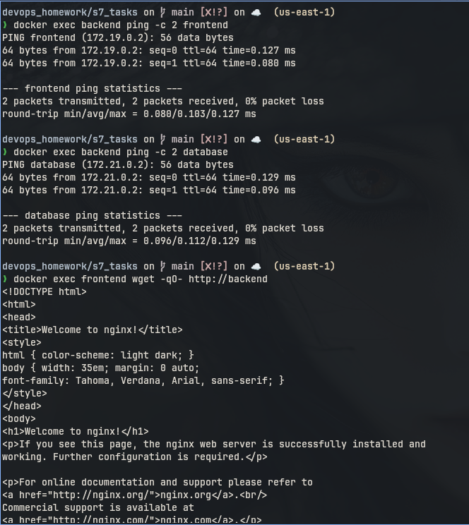
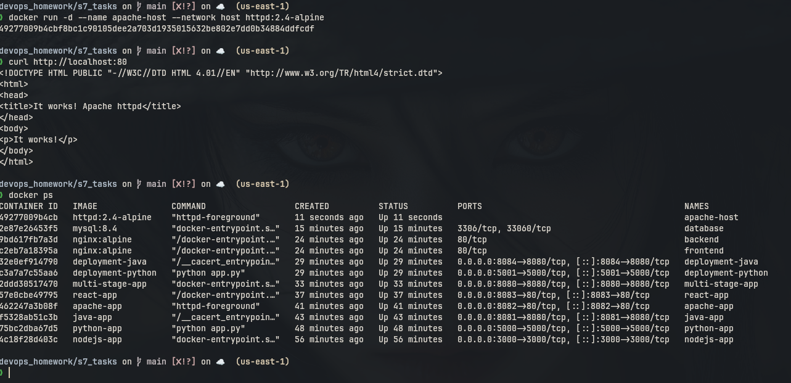
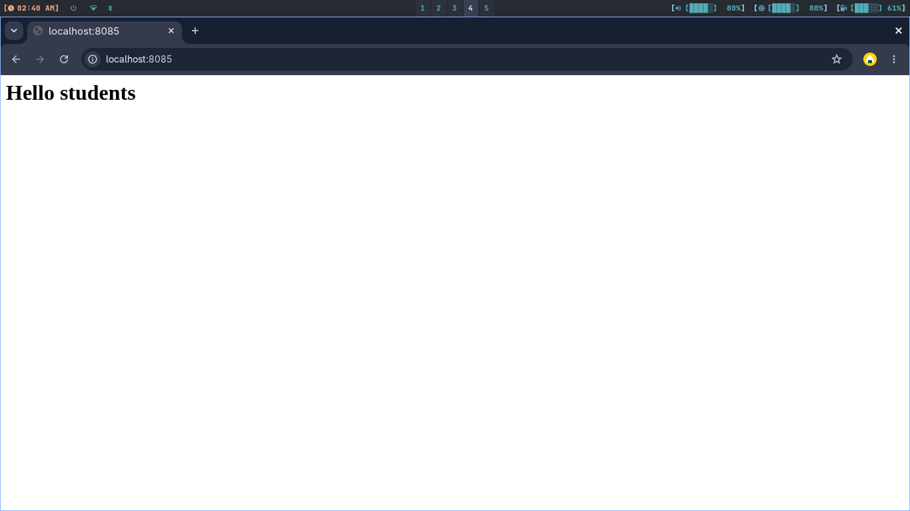
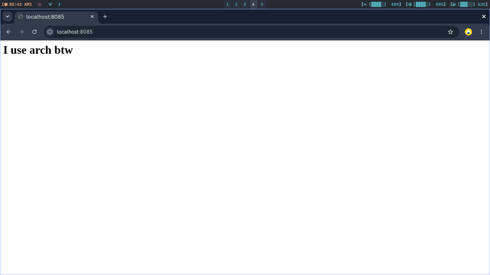
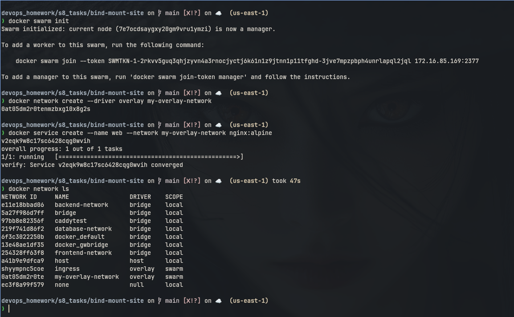

# Session 8: Docker Networking & Volume Tasks

## 1. Docker Container Networking

### Commands

```bash
docker network create frontend-network
docker network create backend-network
docker network create database-network

docker run -d --name frontend --network frontend-network nginx:alpine
docker run -d --name backend --network backend-network nginx:alpine
docker network connect frontend-network backend
docker run -d --name database --network database-network -e MYSQL_ROOT_PASSWORD=rootpassword mysql:8.4
docker network connect database-network backend

docker exec frontend ping -c 2 backend
docker exec backend ping -c 2 frontend
docker exec backend ping -c 2 database
docker network inspect frontend-network
docker network inspect backend-network
docker network inspect database-network
```

### What I understood:

```
Containers on the same Docker network can communicate using container names. Here
backend is connected to frontend-network and database-network, so it can talk to
both frontend and database. Frontend and database are separated from each other.
```

### Screenshot



Connectivity ping output is documented below.



---

## 2. Host Network

### Commands

```bash
docker pull httpd:2.4-alpine
docker run -d --name apache-host --network host httpd:2.4-alpine
curl http://localhost:80
docker ps
```

### What I understood:

```
Host network means the container uses the host network directly. There is no -p
port mapping because Apache listens directly on host port 80.
```

### Screenshot



---

## 3. Bind Mount

### Commands

```bash
cd bind-mount-site
docker run -d --name nginx-bind -p 8085:80 \
  -v "$(pwd):/usr/share/nginx/html:ro" nginx:alpine
curl http://localhost:8085

# edit index.html, save it, then run this again without restarting container
curl http://localhost:8085
```

### What I understood:

```
A bind mount maps a local folder to a container folder. When index.html is changed
on my machine, Nginx shows the updated content without rebuilding or restarting.
```

### Screenshots





---

## 4. Overlay Network

```
Overlay network is used when containers or services need to communicate across
multiple Docker hosts. Docker Swarm manages it. The overlay network creates a
virtual network on top of physical network, so services can find each other even
when containers are running on different machines.
```

### Commands to Practice with Swarm

```bash
docker swarm init
docker network create --driver overlay my-overlay-network
docker service create --name web --network my-overlay-network nginx:alpine
docker network ls
```

### Screenshot


