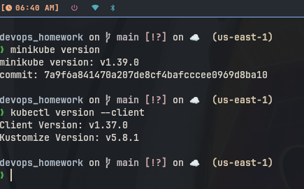
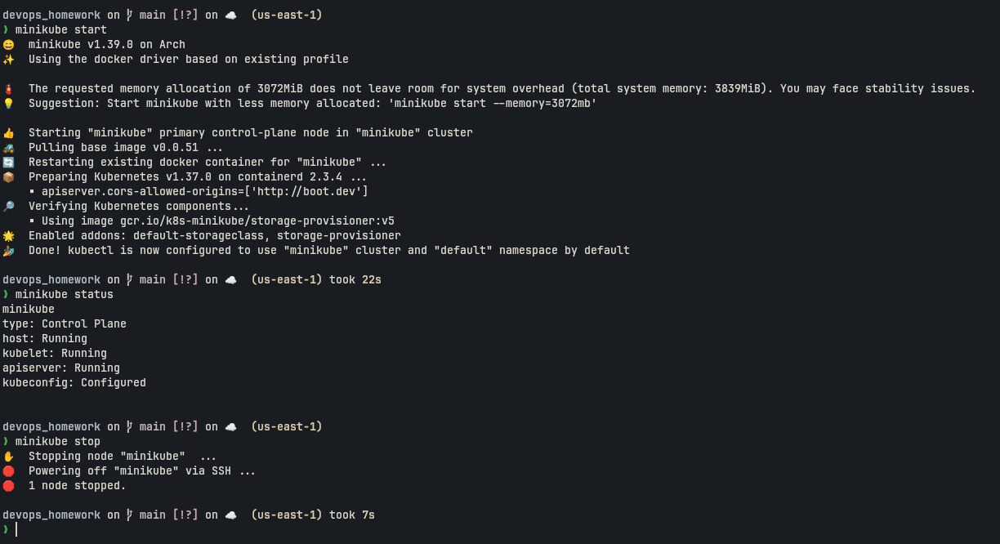
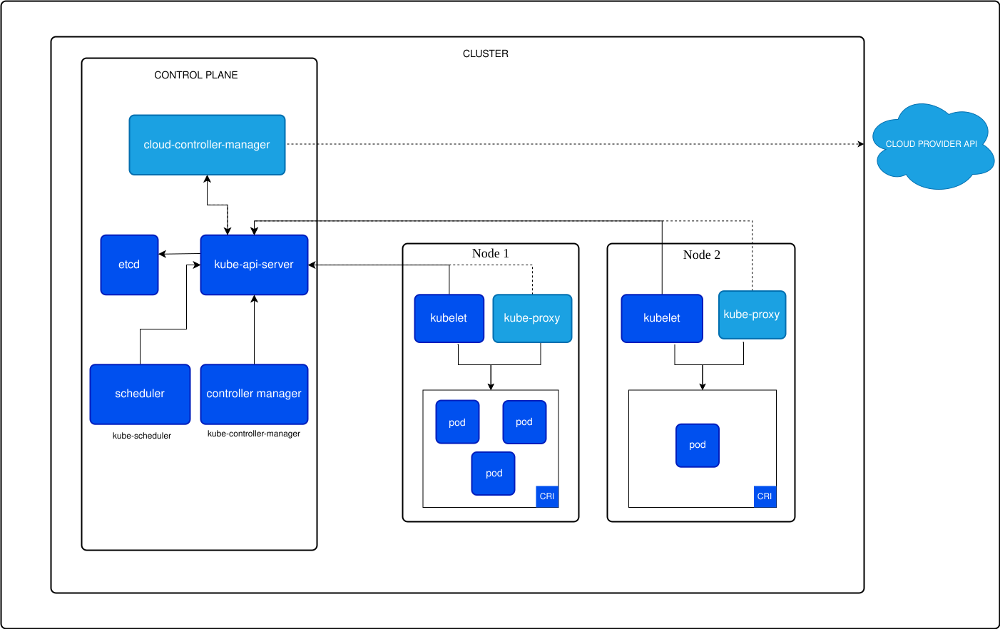

# Session 9: Kubernetes Fundamentals & Cluster Architecture

**Author:** Shah Musharaf ul islam
**Course:** SST DevOps & Cloud [SWE]
**Batch:** B
**Roll No:** 24BCS10447
**Repository:** devops-heros / session9-k8s

---

## 1. Minikube Installation & Environment Setup

### Commands
```bash
minikube version
kubectl version --client
```

### What I understood
Minikube and kubectl are successfully installed on the local system. Version commands confirm both tools are available and ready to use.

### Screenshot


---

## 2. Minikube Cluster Lifecycle Execution

### Commands
```bash
minikube start
minikube status
minikube stop
```

### What I understood
The Minikube cluster was started successfully, verified all components are running, and then stopped cleanly to release system resources.

### Screenshot


---

## 3. Kubernetes Architecture & Core Components

### What I understood
Documented the Control Plane components (kube-apiserver, etcd, kube-scheduler, kube-controller-manager) and Worker Node components (kubelet, kube-proxy, Container Runtime, Pod) based on official Kubernetes documentation.

### Screenshot


---

